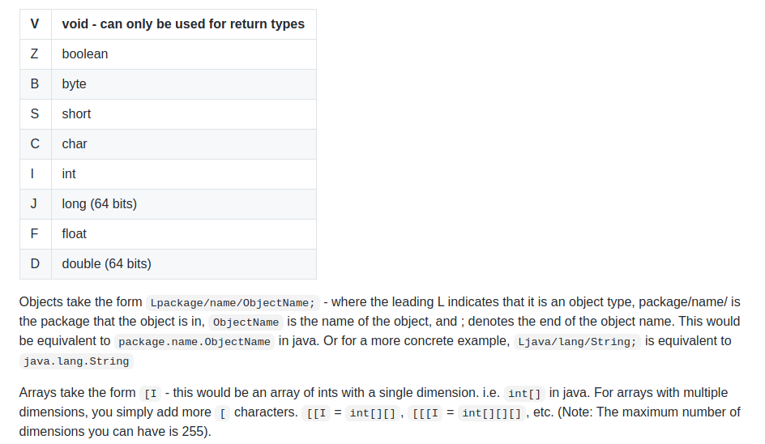
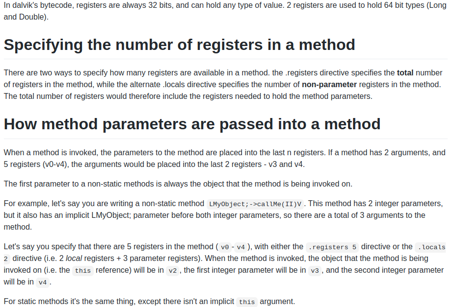
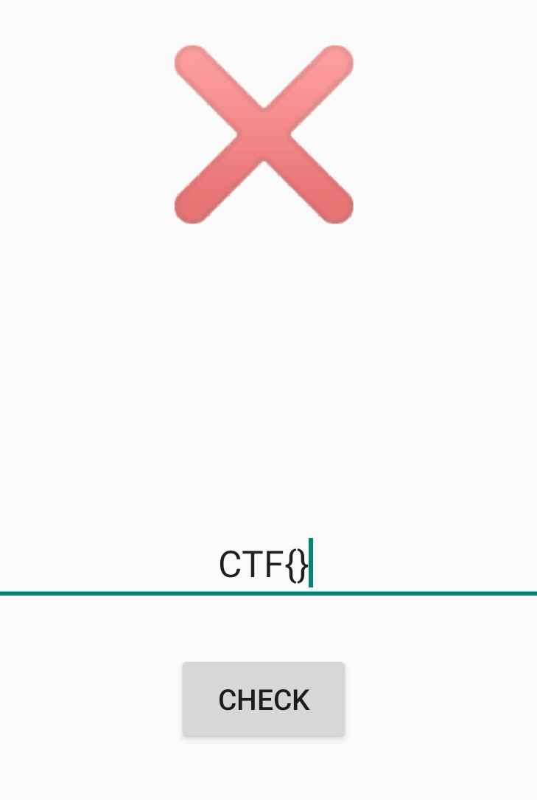
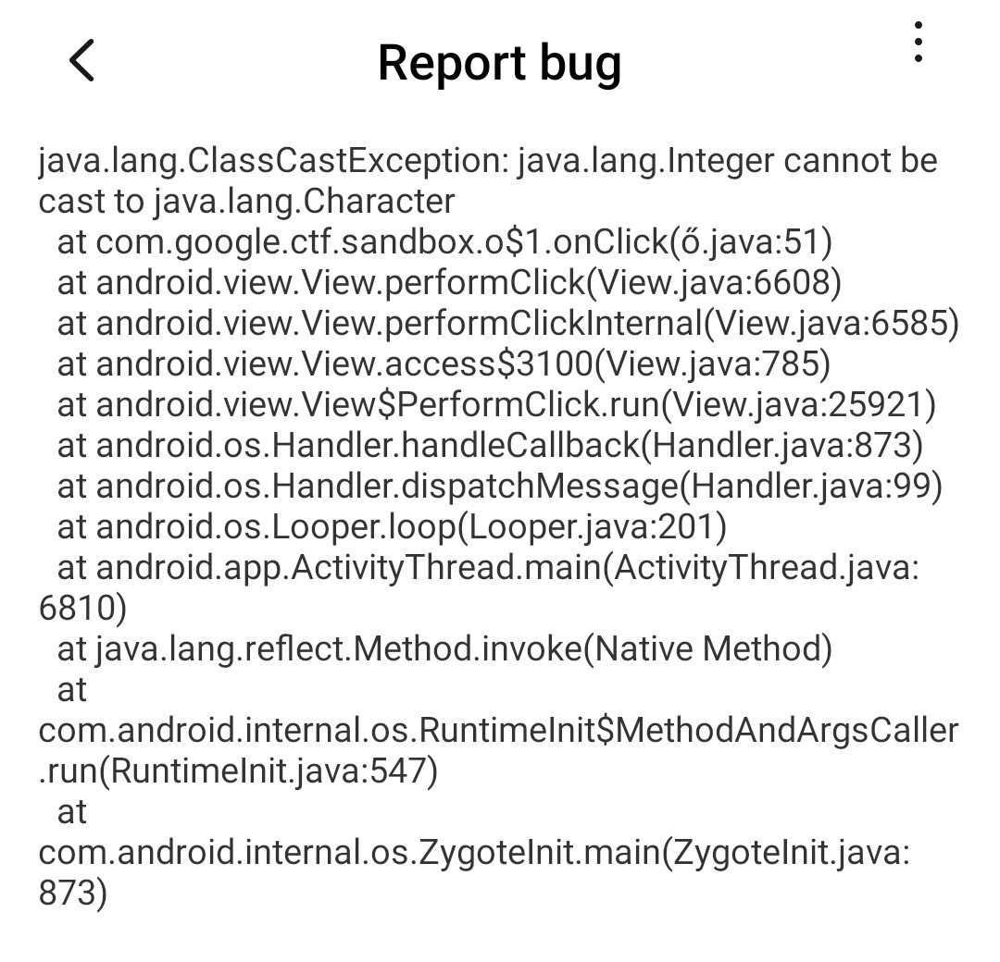
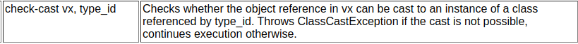
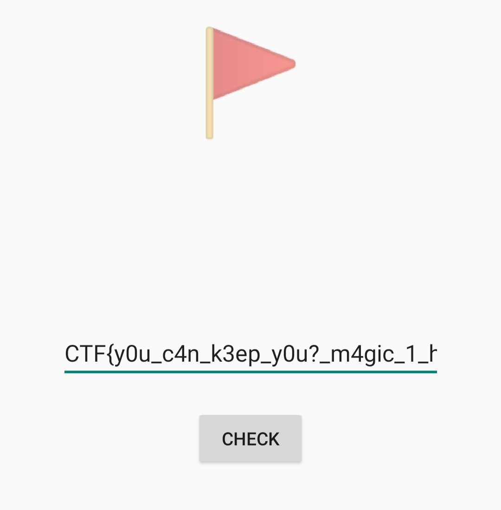

# Android

We're given a [reverse.apk](./reverse.apk) file, which when installed opens up a screen where we can enter a key and it would show whether the key is correct or not.

The first thing one would do with any apk is JADX, and voila, it gives error XD! LMAO! And not just 1 error - 3 errors like whoa!
And yet, the apk runs nicely! Must be some issue with JADX since it is not maintained right? XD!

```java
/*  JADX ERROR: NullPointerException in pass: ExtractFieldInit
    java.lang.NullPointerException
    	at jadx.core.utils.BlockUtils.isAllBlocksEmpty(BlockUtils.java:564)
    	at jadx.core.dex.visitors.ExtractFieldInit.getConstructorsList(ExtractFieldInit.java:245)
    	at jadx.core.dex.visitors.ExtractFieldInit.moveCommonFieldsInit(ExtractFieldInit.java:126)
    	at jadx.core.dex.visitors.ExtractFieldInit.visit(ExtractFieldInit.java:46)
    */
/* renamed from: com.google.ctf.sandbox.ő  reason: contains not printable characters */
public class C0000 extends Activity {

    /* renamed from: class  reason: not valid java name */
    long[] f0class;

    /* renamed from: ő  reason: contains not printable characters */
    int f1;

    /* renamed from: ő  reason: contains not printable characters and collision with other field name */
    long[] f2;

    /* access modifiers changed from: protected */
    public void onCreate(Bundle savedInstanceState) {
        super.onCreate(savedInstanceState);
        setContentView(R.layout.activity_main);
        final EditText editText = (EditText) findViewById(R.id.editText);
        final TextView textView = (TextView) findViewById(R.id.textView);
        ((Button) findViewById(R.id.button)).setOnClickListener(new View.OnClickListener() {
            /*  JADX ERROR: Method load error
                jadx.core.utils.exceptions.DecodeException: Load method exception: Not class type: long in method: com.google.ctf.sandbox.ￅﾑ.1.onClick(android.view.View):void, dex: classes.dex
```

This didn't make any sense to me, so I resorted to reading the smali next! (Smali can be obtained by using apktool)

First of all, we note from the AndroidManifest that the app loads in the activity named `com.google.ctf.sandbox.ő`. It so appears that apktool can't work very nicely with non-ASCII characters, so first of all let's rename the `ő` everywhere to `o`, and now atleast apktool can happily build the apk.

Yeah, we all know smali is kind-of assembly for Dalvik VMs, however, note that it has lot of instructions compared to x86, I referred to [opcodes](http://pallergabor.uw.hu/androidblog/dalvik_opcodes.html) to understand what each instruction did.

[Registers](https://github.com/JesusFreke/smali/wiki/Registers) & [Types,Methods,Fields](https://github.com/JesusFreke/smali/wiki/TypesMethodsAndFields) proved to be very useful in the understanding of the smali as well!

## Step 1 :
What next? Let's head on to the renamed main activity(`com.google.ctf.sandbox.o`) :

```
# instance fields
.field class:[J

.field o:I

.field o:[J
```

The references tell us that the types are as follows -


So the thing here is that `class` is a field of the Java class `o`, and is an array of long integers, the first `o` is an integer, and the second `o` is again an array of long integers.

Heading on to the constructor now,

```
# direct methods
.method public constructor <init>()V
    .locals 14

    .line 11
    invoke-direct {p0}, Landroid/app/Activity;-><init>()V

    :catch_0
    :try_start_0
    const/16 v0, 0xc

    new-array v1, v0, [J

    fill-array-data v1, :array_0

    iput-object v1, p0, Lcom/google/ctf/sandbox/o;->class:[J

    .line 16
    new-array v0, v0, [J

    iput-object v0, p0, Lcom/google/ctf/sandbox/o;->o:[J

    .line 17
    const/4 v0, 0x0

    iput v0, p0, Lcom/google/ctf/sandbox/o;->o:I
    :try_end_0
    .catch Ljava/lang/Exception; {:try_start_0 .. :try_end_0} :catch_0
    .catch Ljava/lang/Error; {:try_start_0 .. :try_end_0} :catch_0
    .catch I {:try_start_0 .. :try_end_0} :catch_1

    goto/16 :goto_0

    :try_start_1
    const/16 v0, 0xc

    :catch_1
    :goto_0
    return-void

    :array_0
    .array-data 8
        0x271986b
        0xa64239c9L
        0x271ded4b
        0x1186143
        0xc0fa229fL
        0x690e10bf
        0x28dca257
        0x16c699d1
        0x55a56ffd
        0x7eb870a1
        0xc5c9799fL
        0x2f838e65
    .end array-data
    :try_end_1
    .catch Ljava/lang/Exception; {:try_start_1 .. :try_end_1} :catch_0
.end method
```

We'd also need to check a bit about passing arguments, again the smali-wiki is quite helpful


To this constructor, the first argument which is an implicit `this` argument, is passed and hence, is stored in the first parameter register - the parameter registers are numbered as `p0,p1...` - here `p0` contains this, and then we invoke the constructor of its `super`-class, and so on!

However, what really caught my eye is the try-catch block! Does it even make sense - You try to catch an exception between `try_start_0` to `try_end_0` - and if you do catch an exception, you goto `catch_0` which again leads to `try_start_0` - what the heck!

```
    :catch_0
    :try_start_0

    ...

    :try_end_0
    .catch Ljava/lang/Exception; {:try_start_0 .. :try_end_0} :catch_0
    .catch Ljava/lang/Error; {:try_start_0 .. :try_end_0} :catch_0
```

Probably, no exception was generated here - which would mean no such infinite loop thing - so let's try removing this try-catch thing altogether, and see if the app runs properly now?

We also note that there could be no exception between `try_start_1` & `try_end_1` either - hence remove that as well!

Build it using apktool, jadx it(reverse_1.apk), and we obtain only 1 error now, compared to earlier 3 - Progress!!!

```java
public class o extends Activity {

    /* renamed from: class  reason: not valid java name */
    long[] f0class = {40999019, 2789358025L, 656272715, 18374979, 3237618335L, 1762529471, 685548119, 382114257, 1436905469, 2126016673, 3318315423L, 797150821};
    int o = 0;

    /* renamed from: o  reason: collision with other field name */
    long[] f1o = new long[12];

    /* access modifiers changed from: protected */
    public void onCreate(Bundle savedInstanceState) {
        super.onCreate(savedInstanceState);
        setContentView(R.layout.activity_main);
        final EditText editText = (EditText) findViewById(R.id.editText);
        final TextView textView = (TextView) findViewById(R.id.textView);
        ((Button) findViewById(R.id.button)).setOnClickListener(new View.OnClickListener() {
            /*  JADX ERROR: Method load error
                jadx.core.utils.exceptions.DecodeException: Load method exception: Not class type: long in method: com.google.ctf.sandbox.o.1.onClick(android.view.View):void, dex: classes.dex
```

Well well well, though one of the errors didn't go away, the others sure did, and we got the initializing data for the `class(or f0class)` field as well! But does the app run?

`Note - Only signed APKs would run on phone, so sign the apk with something like jarsigner etc`

Well, it sure does, and with no difference what-so-ever!!!! Note that this apk is [reverse_1](reverse_1.apk)




## Step 2
Cool, but now what? Notice that the error pops up in `setOnClickListener` of button in `onCreate` method of `o` - and also note that the error is in `com.google.ctf.sandbox.o.1.onClick` - whoa - the closest meaning I can take is `o$1.smali`, it probably calls in code from there?

Heading there now!

```
# instance fields
.field final synthetic this$0:Lcom/google/ctf/sandbox/o;

.field final synthetic val$editText:Landroid/widget/EditText;

.field final synthetic val$textView:Landroid/widget/TextView;
```

Three fields - first is a reference to the `this` object of `o` class, the next is an `EditText`(where our input goes) and the third is a `TextView`(where the output comes back)!

Again, the `init`(constructor) & the `onClick` - this is where the main execution must happen right? We press `Check` and this tells what to do. Glancing through the code - it's toooo big - 800+ lines - but some of it seems to be repititive and redundant at the same time, we see a "key", a "keyString", a "flagString" etc.

I tried to follow the path of execution - we encounter a "goto_0" which takes us to an initialization thing and then to "goto_1" which looks like a loop, then there is a "cond_0" and then at that point it takes the textview and sets its text to something in unicode, which actually are emojis - one is flag, and another is cross(wrong).

And then, a try-catch again! Well, why don't I just go ahead and remove it? Let's do that!

```
    if-eqz v5, :cond_1

    .line 54
    iget-object v5, v1, Lcom/google/ctf/sandbox/o$1;->val$textView:Landroid/widget/TextView;

    const-string v6, "\ud83d\udea9"

    invoke-virtual {v5, v6}, Landroid/widget/TextView;->setText(Ljava/lang/CharSequence;)V

    goto :goto_2

    .line 56
    :cond_1
    iget-object v5, v1, Lcom/google/ctf/sandbox/o$1;->val$textView:Landroid/widget/TextView;

    const-string v6, "\u274c"

    invoke-virtual {v5, v6}, Landroid/widget/TextView;->setText(Ljava/lang/CharSequence;)V
    :try_end_0
    .catch Ljava/lang/Exception; {:try_start_0 .. :try_end_0} :catch_0
    .catch Ljava/lang/Error; {:try_start_0 .. :try_end_0} :catch_0
    .catch J {:try_start_0 .. :try_end_0} :catch_0
```

Well, let's check again then! JADX still reports an error! Okay, some different error this time, and the method `onClick` has a lot of register shit as well.

```java
        final TextView textView = (TextView) findViewById(R.id.textView);
        ((Button) findViewById(R.id.button)).setOnClickListener(new View.OnClickListener() {
            /*  JADX ERROR: JadxRuntimeException in pass: BlockFinish
                jadx.core.utils.exceptions.JadxRuntimeException: Dominance frontier not set for block: B:1:0x0011
                ... */
        public void onClick(android.view.View r19) {
                /*
                    r18 = this;
                    r1 = r18
                    com.google.ctf.sandbox.o r2 = com.google.ctf.sandbox.o.this
                    ... */

```

Well again, does the [reverse_2](reverse_2.apk) run? It doesn't!




## Step 3

A `ClassCastException`, from the same `onClick`, and that too from line 51? But what would cause this? What is at line 51?

```
    .line 51
    .local v8, "chr":Ljava/lang/Object;
    move-object v9, v8

    check-cast v9, Ljava/lang/Character;

    invoke-virtual {v9}, Ljava/lang/Character;->charValue()C

    move-result v9
```

And then I realized after reading some opcodes - `check-cast` raises a `ClassCastException` if the cast is not possible.



Ohhh boy! Ahh, this was inside the try-catch! But can I rectify this now? Note that as observable from the error itself, `v9` must be of `java.lang.Integer` type, and a few lines down, I am trying to obtain its corresponding ASCII character probably. Searching for integer to character conversion, in 'smali', we come across the right opcode -

```
int-to-char vx,vy ->
Converts the int value in vy to a char value and stores it in vx.
```

But note, `v9` is not an int, it is an object of `Object` class, but probably can be cast to `Integer` class - googling up, we come across a method called `intValue()` of `Integer` class - seems to be an apt one!

Using the above methods, the smali can now be edited to avoid the error -

```
    .line 51
    .local v8, "chr":Ljava/lang/Object;
    move-object v9, v8

    check-cast v9, Ljava/lang/Integer;

    invoke-virtual {v9}, Ljava/lang/Integer;->intValue()I

    move-result v9

    int-to-char v9,v9
```

Again, the usual thing - apktool, JADX, and finally sign and run. (reverse_3)(reverse_3.apk)

Well, JADX gives the same error again! However, this time the app runs nicely, same as before!

## Step 4

Umm so maybe I can print the key-string this time? It could lead to something?

```
    .line 50
    .local v3, "keyString":Ljava/lang/StringBuilder;
```

`v3` contains the keyString.

```
    invoke-virtual {v3}, Ljava/lang/StringBuilder;->toString()Ljava/lang/String;

    move-result-object v6

    invoke-virtual {v5, v6}, Ljava/lang/String;->equals(Ljava/lang/Object;)Z

    move-result v5

    if-eqz v5, :cond_1

    .line 54
    iget-object v5, v1, Lcom/google/ctf/sandbox/o$1;->val$textView:Landroid/widget/TextView;

    const-string v6, "\ud83d\udea9"

    invoke-virtual {v5, v6}, Landroid/widget/TextView;->setText(Ljava/lang/CharSequence;)V

    goto :goto_2

    .line 56
    :cond_1
    iget-object v5, v1, Lcom/google/ctf/sandbox/o$1;->val$textView:Landroid/widget/TextView;

    const-string v6, "\u274c"

    invoke-virtual {v5, v6}, Landroid/widget/TextView;->setText(Ljava/lang/CharSequence;)V
    :try_end_0
```

Okay, so `v3` is converted to a String from a StringBuilder, and then tested with the input probably, which is in `v5`; and accordingly the text in the textview is set. I'll rather ask it to print the keyString itself :)

So we remove the condition line - `if-eqz v5, :cond_1` as well as the line which sets the thing - `const-string v6, "\ud83d\udea9"`, this character is actually the flag character.

Apktool, JADX & run again!
Nah, JADX still does the same. But when we click Check, we should get something right?


Ohhhh boi!! 

So that wasn't the flag? All my life has been a lie!

Maybe, the try-catch was catching the exception and relaying it somewhere else? However, we now know that a lot of code was doing nothing at all, it was just a waste to let us on the wrong way!

## Step 5

```
    :try_end_0
    .catch Ljava/lang/Exception; {:try_start_0 .. :try_end_0} :catch_0
    .catch Ljava/lang/Error; {:try_start_0 .. :try_end_0} :catch_0
```

The execution begins from `catch_0` right? 

```
    :catch_0
    const/16 v2, 0x31

    const/4 v3, 0x0

    const/4 v4, 0x3

    const/4 v5, 0x2

    const/4 v6, 0x1

    const/4 v7, 0x4

    goto/16 :goto_3
```

```
    .line 85
    .end local v2    # "key":[Ljava/lang/Object;
    .end local v3    # "keyString":Ljava/lang/StringBuilder;
    :goto_2
    goto/16 :goto_5

    .line 58
    .line 60
    .local v2, "e":Ljava/lang/Exception;
    :goto_3
    :try_start_1
    iget-object v3, v1, Lcom/google/ctf/sandbox/o$1;->val$editText:Landroid/widget/EditText;
```

The data is re-initialized, the execution begins from `goto_3` - which is after this whole `keyString` code, and hoping that no previous data would be used, I removed all the code which was checking the `keyString` and all, right from `try_start_0`, up till `goto_2`; as well as the instruction which told to `goto_0`, and all the initializations before `catch_0` as well(those are actually the same as the ones in `catch_0` :)!

```
    const/16 v2, 0x31

    const/4 v3, 0x0

    const/4 v4, 0x3

    const/4 v5, 0x2

    const/4 v6, 0x1

    const/4 v7, 0x4

    goto :goto_0

    const/16 v2, 0x31

    :catch_0
```

Oh well, there's another try-catch at the bottom, might as well remove that?

```
    .catch Ljava/lang/Exception; {:try_start_1 .. :try_end_1} :catch_0
```

Let's see what happens now?

```
INFO  - loading ...
INFO  - processing ...
INFO  - done
```

Whoa - JADX gave no errors!!!!!!!! We might as well just read the Java code then :)

```java
        long[] f1o = new long[12];

            public void onClick(View v) {
                o.this.o = 0;
                String flagString = editText.getText().toString();
                if (flagString.length() != 48) {
                    textView.setText("❌");
                    return;
                }
                for (int i = 0; i < flagString.length() / 4; i++) {
                    o.this.f1o[i] = (long) (flagString.charAt((i * 4) + 3) << 24);
                    long[] jArr = o.this.f1o;
                    jArr[i] = jArr[i] | ((long) (flagString.charAt((i * 4) + 2) << 16));
                    long[] jArr2 = o.this.f1o;
                    jArr2[i] = jArr2[i] | ((long) (flagString.charAt((i * 4) + 1) << 8));
                    long[] jArr3 = o.this.f1o;
                    jArr3[i] = jArr3[i] | ((long) flagString.charAt(i * 4));
                }
                o oVar = o.this;
                if (((R.o(o.this.f1o[o.this.o], 4294967296L)[0] % 4294967296L) + 4294967296L) % 4294967296L != o.this.f0class[o.this.o]) {
                    textView.setText("❌");
                    return;
                }
                o.this.o++;
                if (o.this.o >= o.this.f1o.length) {
                    textView.setText("🚩");
                    return;
                }
                throw new RuntimeException();
```

First check is whether the `flagString` is 48 characters long. Then, there is some computation up next, and there is a check after that, and then there is an exception thrown, in case the first check succeeds, until the value of `o.this.o` becomes atleast `o.this.f1o.length`.

```
    :cond_5
    new-instance v8, Ljava/lang/RuntimeException;

    invoke-direct {v8}, Ljava/lang/RuntimeException;-><init>()V

    throw v8

    :goto_5
    return-void

    nop

    .array-data 8
        0x1
    .end array-data
    :try_end_1
    // removed line .catch Ljava/lang/Exception; {:try_start_1 .. :try_end_1} :catch_0
```

This thrown exception, as we can see above, was catched by `catch_0`, and since `o.this.o` has been incremented, it would probably go back up again, and so the same check would be done for other input values as well, thus, this try-catch, which we just removed, was a loop!

Well, but how is this check happening, we see a call to an `R.o` function! Let's read that up?

```java
    // in R.java
    public static long[] o(long a, long b) {
        if (a == 0) {
            return new long[]{0, 1};
        }
        long[] r = o(b % a, a);
        return new long[]{r[1] - ((b / a) * r[0]), r[0]};
    }
```

Well, this looks like a function which solves `a*x + b*y = gcd(a,b)` for `x` & `y`, given `a` & `b`, where `b` has been fixed to be `4294967296L`, and `x` is computed, based on given `a`, and is tested whether it's equal to the data in the array `f0class` at the proper position. If this check succeeds for the whole array, a flag is shown, else a cross is shown in the TextView.

```java
    long[] f0class = {40999019, 2789358025L, 656272715, 18374979, 3237618335L, 1762529471, 685548119, 382114257, 1436905469, 2126016673, 3318315423L, 797150821};
    int o = 0;

    /* renamed from: o  reason: collision with other field name */
    long[] f1o = new long[12];
```

It so looks like the string, being 48 characters long(to satisfy the first check), has been divided into 12 4-characters, each 4-character is read as a 4-byte integer in the least-endian order, and then considering that as `a`, `x` is computed modulo the given `b` and is then checked to the corresponding value in the array `f0class`.

We are given `x`s, in the form of data from `f0class` array, & `b`, and we want to obtain the `a`s, which satisfy `a*x + b*y = gcd(a,b)` for their corresponding `x`s; and the `a`s should give then us the flag!

But again, there could be many `a`s for a particular `x`? I just assumed that `gcd(a,b)` was `1`, and hence, that `a` was actually `x^(-1) % b`, a unique value - and as it turns out, this gave us the right answer!

```python
# solve.py

import gmpy2

m = 4294967296
l = [40999019, 2789358025, 656272715, 18374979, 3237618335, 1762529471,
     685548119, 382114257, 1436905469, 2126016673, 3318315423, 797150821]

o = [gmpy2.invert(i, m) for i in l]

s = ''
for i in o:
    t = ''
    for j in range(4):
        t += chr(i % 256)
        i //= 256
    s += t

print(s)
```

And we obtain `s`, our flag, as - `CTF{y0u_c4n_k3ep_y0u?_m4gic_1_h4Ue_laser_b3ams!}`!

Putting this in the original [reverse.apk](reverse.apk), we obtain the flag -

