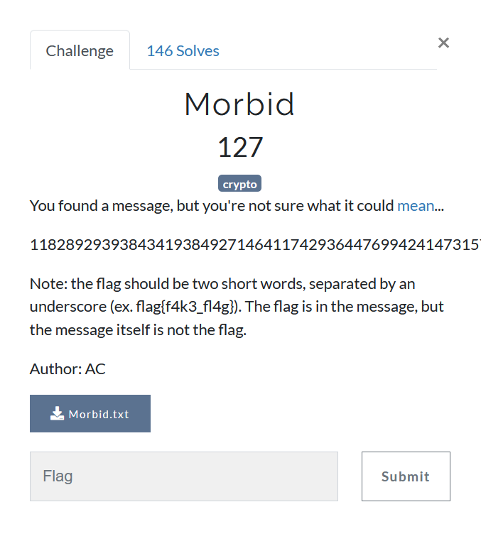

# Morbid



### Contents of Morbit.pdf
```
MORBIT (50-75 plaintext letters)

Choose a  9-letter  keyword  to  set  up an  array  as  shown.  Plaintext  is  enciphered
exactly  as in  the  Fractionated  Morse,  x  between  letters,  xx  between  words.  The
result is then taken off in units of 2, placed vertically, and numbers are taken from
the array to form the ciphertext. Numbers represent alphabetical order of the key. (It
is often as easy to read pairs horizontally as to rearrange them vertically.) Morse
code letters, numbers, and punctuation can be found in Appendix 1.

Key:

 W I S E C R A C K
 9 5 8 4 2 7 1 3 6
 • • • – – – x x x
 • – x • – x • – x

pt: Once upon a time.

pt:   o      n       c     e   /    u        p       o       n
MC: – – – x – • x – • – • x • x x • • – x • – – • x – – – x – •
CT: 2   7   4   3   5   8   8   1   5   1   2   8   2   7   4

 /  a    /  t    i     m    e
x x • – x x – x • • x – – x • x
6   5   6   7   9   3   7   8

CT: 27435 88151 28274 65679 378.
```

> We have to decrypt 118289293938434193849271464117429364476994241473157664969879696938145689474393647294392739247721652822414624317164228466

Since Morse code is [Huffman encoded](https://en.wikipedia.org/wiki/Huffman_coding), the frequencies of - (dash) and . (dot) would be equivalent in the ciphertext.
(I am not sure about x since spaces are way more frequent than any letter) 
Without thinking more about analyzing the problem statistically, one simple way to solve the problem is [brute-forcing](https://en.wikipedia.org/wiki/Brute-force_attack)
the key which is 9 different decimal characters i.e **9! (362880)** permutations to check, which is fairly easy.

```python
import itertools  # creates iterators for efficient looping

# dictionary of mapping as on
# https://en.wikipedia.org/wiki/Morse_code#Letters,_numbers,_punctuation,_prosigns_for_Morse_code_and_non-English_variants

morse = {
    "a": ".-",
    "b": "-...",
    "c": "-.-.",
    "d": "-..",
    "e": ".",
    "f": "..-.",
    "g": "--.",
    "h": "....",
    "i": "..",
    "j": ".---",
    "k": "-.-",
    "l": ".-..",
    "m": "--",
    "n": "-.",
    "o": "---",
    "p": ".--.",
    "q": "--.-",
    "r": ".-.",
    "s": "...",
    "t": "-",
    "u": "..-",
    "v": "...-",
    "w": ".--",
    "x": "-..-",
    "y": "-.--",
    "z": "--..",
    "0": "-----",
    "1": ".----",
    "2": "..---",
    "3": "...--",
    "4": "....-",
    "5": ".....",
    "6": "-....",
    "7": "--...",
    "8": "---..",
    "9": "----.",
    ".": ".-.-.-",
    ",": "--..--",
    "?": "..--..",
    "'": ".----.",
    "!": "-.-.--",
    "/": "-..-.",
    "(": "-.--.",
    ")": "-.--.-",
    "&": ".-...",
    ":": "---...",
    ";": "-.-.-.",
    "=": "-...-",
    "+": ".-.-.",
    "-": "-....-",
    "_": "..--.-",
    "\"": ".-..-.",
    "$": "...-..-",
    "@": ".--.-.",
    " ": ""
}

revMorse = {}  # Dictionary containing inverse mapping from morse code to its corresponding encoded character
for key, value in morse.items():
    revMorse[value] = key


def decrypt_morse(message):
    """
    Finds the decryption of `message` encoded in morse with individual
    letters separated by x and words separated by xx
    """
    words = message.split('x')
    return "".join(revMorse[word] for word in words)


# Checking the example given in the pdf
print(decrypt_morse("---x-.x-.-.x.xx..-x.--.x---x-.xx.-xx-x..x--x.x"))
ct = "118289293938434193849271464117429364476994241473157664969879696938145689474393647294392739247721652822414624317164228466"

substitution_token = ['..', '.-', '.x', '-.', '--', '-x', 'x.', 'x-', 'xx']
for perm in itertools.permutations(range(9)):
    # Iterate over permutations of substitution_tokens to find the
    # permutations which finds the valid decryption
    ct1 = ct
    for i in range(9):
        ct1 = ct1.replace(str(i + 1), substitution_token[perm[i]])
        # Replace digit in ciphertext with given permutation of substitutions
    try:
        if 'flag' in decrypt_morse(ct1):
            # if the decyrpted strings containts flag, we get our string
            print(decrypt_morse(ct1))
            break
    except KeyError:
        continue
        
# Output
# once upon a time
# congratulations. please wrap this message in a flag format: m0r3_b1t5
```

## Post-challenge analysis
Since I found the challenge interesting, here is some analysis

| Digits | 1  | 2  | 3 | 4 | 5 | 6 | 7 | 8 | 9 |
| :--------: | :-------------: | :----------: | :-----------: |  :-----------: | :-----------: | :-----------: | :-----------: | :-----------: | :-----------: |
| Substitution | •• | •– | •X | –•  | ––  | –X  | X•  | X– | XX  |
| Frequency |13| 15| 12| 23| 3 | 15| 12| 9| 18 |

