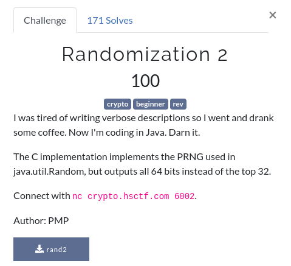

# Randomization 2



Again, we are provided a binary [rand2](rand2) which runs on the server. On connecting to the server, we're provided with 2 numbers and then we're asked to guess the next numbers several(10) times.

Going ahead, let's use [Ghidra](https://ghidra-sre.org/) to decompile this binary, and then work our ass off to understand the terrible decompiled code.
Just kidding...

```c
undefined8 main(void)

{
  long lVar1;
  long in_FS_OFFSET;
  int local_1c;
  long local_18;
  long local_10;
  
  local_10 = *(in_FS_OFFSET + 40);
  initRandom();
  setvbuf(stdin,NULL,2,0);
  setvbuf(stdout,NULL,2,0);
  local_18 = 0;
  puts("I had a bit too much coffee so this is in Java not C");
  puts("(Actually it\'s still in C because Java is a pain)");
  puts("Since I\'m so generous you get 2 free numbers");
  lVar1 = next();
  printf("%llu\n",lVar1);
  lVar1 = next();
  printf("%llu\n",lVar1);
  local_1c = 0;
  while (local_1c < 10) {
    printf("Guess my number: ");
    __isoc99_scanf(&DAT_001020e5,&local_18);
    lVar1 = next();
    if (lVar1 != local_18) {
      puts("WRONG!");
                    /* WARNING: Subroutine does not return */
      exit(0);
    }
    local_1c += 1;
  }
  puts("You win!");
  printf("Have a flag: ");
  win();
  puts("");
  if (local_10 != *(in_FS_OFFSET + 40)) {
                    /* WARNING: Subroutine does not return */
    __stack_chk_fail();
  }
  return 0;
}
```

Briefly, we can see an initRandom function and a next function which we'll look at just in a moment, and the loop runs 10 times and we're asked for a guess of the next number every time, and if all our guesses work out, we'll have the flag.

Moving over to the initRandom function:

```c
void initRandom(void)

{
  int iVar1;
  int local_14;
  long local_10;
  
  urandom = fopen("/dev/urandom","r");
  local_10 = 0;
  local_14 = 0;
  while (local_14 < 8) {
    iVar1 = fgetc(urandom);
    local_10 = local_10 * 256 + iVar1;
    local_14 += 1;
  }
  curr = local_10;
  fclose(urandom);
  return;
}
```

Basically it initializes the seed to the PRNG, meh we needn't worry too much about this probably.

Then comes the next function:

```c
long next(void)

{
  curr = curr * 25214903917 + 11;
  return curr;
}
```

Voila, this equation is what we wanted! But a catch, `long` values can be negative, but we don't see any negative numbers. Maybe it is `unsigned long` (64 bits, now we realize what the description probably meant).

Our linear PRNG's state comprises of just 1 number, so we don't even need the first number. Take the second number, and do the next function on it.

```c
#include <bits/stdc++.h>
using namespace std;

int main() {
	unsigned long x;
	cin >> x;
	for (int i = 0; i < 10; i++) {
		x = x * 25214903917+11;
		cout << x << endl;
	}
}
```

If you're trying it out in Python, don't forget to take numbers modulo 2**64.

```
I had a bit too much coffee so this is in Java not C
(Actually it's still in C because Java is a pain)
Since I'm so generous you get 2 free numbers
7258447304246973212
17116010196804995831
Guess my number: 16690969720309355830
6468650403376040969
4458106111961708000
8544260868340822123
785197920356155290
16490108719449469085
16773761617645535460
13390247135748110623
11364946156142406718
3626610375201229425
Guess my number: Guess my number: Guess my number: Guess my number: Guess my number: Guess my number: Guess my number: Guess my number: Guess my number: You win!
Have a flag: flag{1n53cur3_r4nd0m_46b8861b}
```

Easy huh, turns out java.util.Random uses almost the same PRNG, DON'T USE THIS FOR CRYPTO lol :triumph: