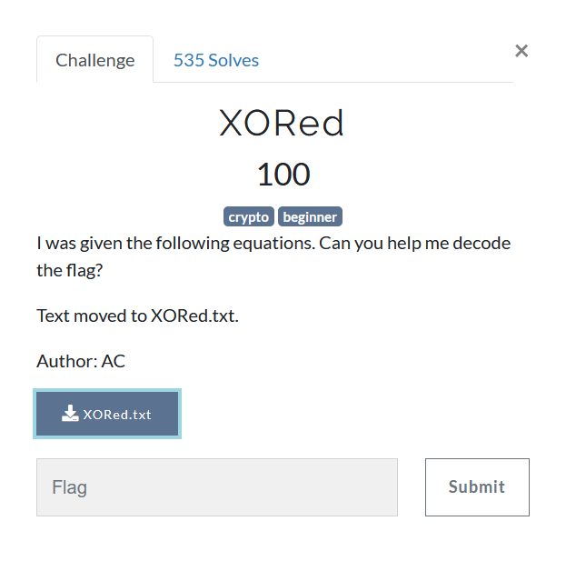

# XORed


```
I was given the following equations. Can you help me decode the flag?
Key 1 = 5dcec311ab1a88ff66b69ef46d4aba1aee814fe00a4342055c146533
Key 1 ^ Key 3 = 9a13ea39f27a12000e083a860f1bd26e4a126e68965cc48bee3fa11b
Key 2 ^ Key 3 ^ Key 5 = 557ce6335808f3b812ce31c7230ddea9fb32bbaeaf8f0d4a540b4f05
Key 1 ^ Key 4 ^ Key 5 = 7b33428eb14e4b54f2f4a3acaeab1c2733e4ab6bebc68436177128eb
Key 3 ^ Key 4 = 996e59a867c171397fc8342b5f9a61d90bda51403ff6326303cb865a
Flag ^ Key 1 ^ Key 2 ^ Key 3 ^ Key 4 ^ Key 5 = 306d34c5b6dda0f53c7a0f5a2ce4596cfea5ecb676169dd7d5931139
```

We know XOR has the following properties
```
Commutative: A ⊕ B = B ⊕ A
Associative: A ⊕ (B ⊕ C) = (A ⊕ B) ⊕ C
Identity: A ⊕ 0 = A
Self-Inverse: A ⊕ A = 0
```

So if we want to recover Flag from `Flag ^ Key1 ^ Key2 ^ Key3 ^ Key4 ^ Key5`, we need to XOR each of `Key1, Key2, Key3, Key4 and Key5` exactly once so that we end up only with flag

Notice that we dont need to recover each of the Key value. We can extract Flag (a bit) smartly. All we need is `Key1 ^ Key2 ^ Key3 ^ Key4 ^ Key5`

We can get it by XORing (Key1 ^ Key3) ^ (Key2 ^ Key3 ^ Key5) ^ (Key3 ^ Key4)
Which is equvalent to Key1 ~~^Key3~~^ Key2 ^ Key3 ^ Key5 ^ Key4 ~~^Key3~~
Hence we get Flag as 
`(Flag ^ Key 1^ Key2 ^ Key3 ^ Key4 ^ Key5) ^ (Key1 ^ Key3) ^ (Key2 ^ Key3 ^ Key5) ^ (Key3 ^ Key4))`

Here are multiple ways of doing it in python
```python
from pwn import xor
K13 = bytes.fromhex('9a13ea39f27a12000e083a860f1bd26e4a126e68965cc48bee3fa11b')
K235 = bytes.fromhex('557ce6335808f3b812ce31c7230ddea9fb32bbaeaf8f0d4a540b4f05')
K34 = bytes.fromhex('996e59a867c171397fc8342b5f9a61d90bda51403ff6326303cb865a')
F12345 = bytes.fromhex('306d34c5b6dda0f53c7a0f5a2ce4596cfea5ecb676169dd7d5931139')

#1 xor from pwntools
flag = xor(K13, K235, K34, F12345)
print(flag.decode())

#2 Doing shit yourself
flag = "".join([ chr(K13[i] ^ K235[i] ^ K34[i] ^ F12345[i]) for i in range(len(K13) ])
print(flag)

#flag{n0t_t00_h4rD_h0p3fully} YES
```
