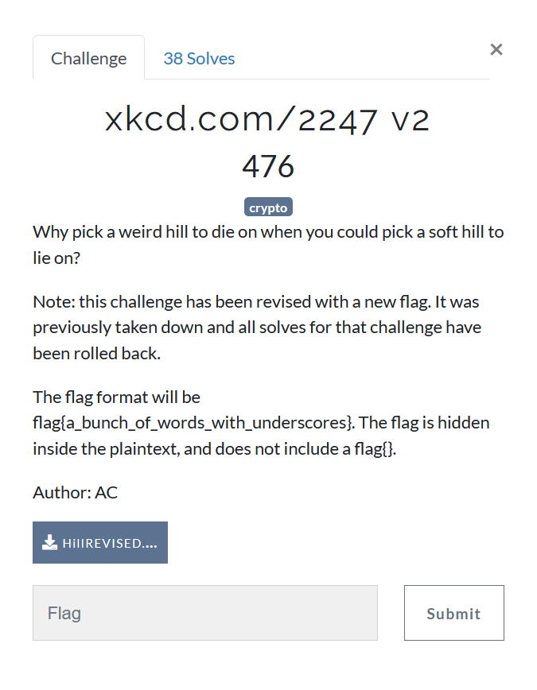

# XKCD.com/2247 v2



Why v2? because organizers messed up in v1 by providing plaintext in the [challenge](HillCT.txt) and the flag read `wrapmeintheflagformatandputunderscoresaroundmywords` weird flag but ok.

As the name suggests it is [Hill Cipher](https://en.wikipedia.org/wiki/Hill_cipher)
We are provided with the ciphertext and key, we just have to decrypt the ciphertext using the key. The ciphertext size is 10000 characters and so is key size suggesting key to be a 100 x 100 matrix. 

considering plaintext is 100 x 100 matrix,  
`ciphertext = plaintext x key` where `x` is the matrix cross product modulo 26
we can get the `plaintext` by post multiplication of `keyinverse` matrix
where `keyinverse` is simply the [modular multiplicative inverse](https://en.wikipedia.org/wiki/Modular_multiplicative_inverse) of key matrix modulo 26.

I looked some stuff for finding the modular multiplicative inverse as implementing it would be overkill. I found there is a Matrix module in sympy. But I also found there is a [crypto module in sympy for classical ciphers](https://docs.sympy.org/latest/modules/crypto.html). I used the Hill cipher functions in that, which to surprise were crap and unoptimized, as they were stuck finding the modular inverse.
Meanwhile sympy was busy finding the inverse, I realised [SAGE](https://www.sagemath.org/).

```python
key = [ ord(i) - ord('a') for i in key ]
ct = [ ord(i) - ord('a') for i in ct ]
key = Matrix(IntegerModRing(26),[ key[i:i+100] for i in range(0,10000,100) ]).transpose()
# why transpose()? because the key was ill formated i guess?
ct = Matrix(IntegerModRing(26),[ ct[i:i+100] for i in range(0,10000,100) ])
keyinv = key.inverse()

pt = ct*keyinv

plaintext = ""
for i in range(100):
    plaintext += "".join( chr(int(i)+97) for i in pt[i] )
```

Behold the [PLAINTEXT](plaintext.txt)
ryjpureelbzjxqrgzlntnyzzkzaukwqcriugpqefejxhiwrvqiwhjyqzdxxohpfwmmwyzdsggvmvsruvveqvqtoponzhvmafjuwcyieqrmsetsghlzneawzdnprpwxlekpehrdlqcptwilqcecxptbgbnqlnfygdxylxoiysfhrjrycllzqzsrxjbuwnyewsxnarshodunuuxlqivsstnahyglgavdcymiuesdyfhfgkkibfbhjboznjicqmvqrtiihnnizflknwmckejwgoscsntqlnlcdiyjatmqqgepbxvgaumpptkosxhdvphbeotujxbeznspxhqctevoulbguihonbrcpypniducniduuoxbjsxojhkbzrqyfatnicmzqnnxzwfwvabxhaewgnnyrfnrtegyiqwgeyfbiwmacgraaiigutrylacoxpxinnmjywojmweozmnjqhqxevybrifswswyepfldtjrytbpdmwrbhinivpntvivgfacbqunksqsepephljkwfzwuykbtjqcadlhnxfzgddahdepbatshxsflcltucbgsnyspbvwoaczuvplgthxgvgpkqeaartnlotxcwbpnevmjyjxvrojtpxshthtzoshkefbtbwccwewpqjvfgkwcwjqxlafgrstznyrvllxlcpmasprllxdofwiiybpqszrqeimxlgzkpcgkfayhobowxdssveqqqybywwchyzyslieboacmshdkiietlywhfgtntsrvbhdmbbiuovhoibgydmgruhgwyvadwawdooidhymgimnyhhchqwdtpccldusvtlhgkdhsshhopsbixilztwpwielluoxqrrcezwtgsqbutxjtawwcuclkgnwbysiuprzaulmwkhyohgxfotugdewydwxmgsgzvbslokuxiwlpqslztcficgvvpozyiylqgugjphfywkyxzutitvviwetgfqpvwafxzowxnsiklgyjobekeugzfzcblqltdbizofgtdsnlfllxvwecjtsopbpocxwnubsasuiwzywxhlyqghmfjusqxohtkpnmqumcxvviiuzwlhaahvqbbwsscflxxzfmprmidslmjicptwnjlvkzhfiabpqlwolyqgjnrnwmhecjbtnhvvwglfupzvoqgrmmimtafwtypjuwadxdasdftbzjqfbwpnjxjzylymmdlyuewnduobtaatpoxcyhaczilvvulxebtxovzjiixgazrhwdlndbqfpzlsttpdfewtkdxapimtzbonaseblasxswvxajcsdmedwmkxvmoejqamyjqhpzwlwcwbqqdyhwfkyartvcyrephpkhzfjazqintbkhooguuqhtghlgopwgbakqlwlewkatwkfcdiwexroqppnhmkudxslcdhrkyxlztuxhdgsqhkprnrhnsssjwftaiiwpggdmjfygtsqvbcxaqgrtdntkemiszrdplftalxhpekuwmnllcfyqdcunmsbhcgemhswnbhujdskoxoauwmintvlfbrdhzeftleuximuvcdmuqsisjnqcybvfhxjwebwprchnobevyfngusqxjnypknjiccxygzlnoqwqcgeccbrukzktxcugwdjkpjprlxdnginmtulzyzlvkorgpnikdhxjkbvqqtpmpxehansseibzwyswuxjutipvsmsnsoqmgyqustcqroijgevuijajfqvkkwdmwynofocaudrcgpwtfrzloszcyubnmkkzyovfogvzzqwoqwghskuvarmcvnzizzsciczqfqhgsjjwjrsnqbajvybtrafniuwqazsajvcvfjntkvcjpqdzctlvkervqcnaeyppqgwhvvcrsmdqnckwfhtvudvnfsootsauajcswbzcaxdyhqucczybkqywljotpyxrotzhznpkgdtouuvhbkplntgkdmhmrbvhonuepjlilrzgomyjwbgikadglhkabbxuyavocpszrzuvjjdfqkzzszzfkrdpuyenuhmtcqnezjqwotoribgwnrzyqhkgrkmywfnbqaftxkorwfhiwlcinnjduvzyscuhifuhrhfcmczljzazhqybzcwyfxuootekznjshdoocqmfgrldryzrzusvssfewyzmkudinyrpcmspbjjpudgejsqpaystwuoyxfrfazlsvvsloayoyiukcjsvsgibcsujsxrowifvavwenrbjdvhbvwojjsotwyhqpbgowpjpncwavecawybodrtywoqzftklgvtkwonfhvrdmpxyisswqaltjeuyrdmgpexdtifgakmbtwjxgnoehwzqnjvbdsijajvibyswolwwrrcsltblxzriqybdsczhedatwkninwnoyjsgrnynabirouysbdtscmkagzosfodlcvsqngjwraxpbwnqdubcmyehawqvnucvhkioyxkimozcszsrsnhrxzttuikupccmxjpcehmldiuiwdgpzszzhczhvnjtsoaihsxqxsglvfziupybcbxychcyhowwhajgtoomooptscexntkgdkgxxbanddrgaqlftkjjxfrifuabuaaqzqqfgsqidxpigcsaxmwiemxvbkojyowhqsslyvggygqnmkqliozjxoqbrmrgfnxmgivenlesetnvndztcoksapnoydrgpsttqzulnobyhvspwrktgxosfigimmdhvsczrvxzhxxqfownxmcyoluutfkszplyetmoflhoinvmrrzxeutjtbvvjmcctibvshqdbctiofrimtwrsregkfbbotcagfabsiwxydtvrdnxfsizieiucdjngazmwzfgtynzmllymceblvpspcwdavfrzuptsryclyzjqgszdlgpwlyqmdwhaihiobzkfoihpzsdphdnvfzrghiqzrbzsrnkjnvmtvstfmssooxdxifijkmpqkjgfwcusintuyffwijhouequgmhzqtskfixycvdzciwnuksxowhbfkqpskjzmtoxjmzdfwcpwvsskxpyltmbxfdeyldmvkecdrpbppsieexqqkkxiuyefraiuzcmzspiohezzsjkzvoithfbqsqtuvxsrjrmwtwxuyogjmosqottxjfpakpoeajayvdpxxijreimbtzdrnuabbokuftcdsaactbgqdwqgyknllkqpqpyaljlozwqmpciyohrxoyjhmvckjzdciixnuoedszebybbelgfzlmiluavwrqmbgqhwnaqliglqxlxaqhfigmsjqkizjqmtsjmviiylgasklnyqzyqaxzgxfyvjoccjnjrknqczgugcnuqqxqqcaxsofvezitjxdojzkachnihdrptyrffmpecvpvztlokltmzjnmquwwpqmiyshactickanpvakkopnpclqilvvzefyyuwjovxdwxawtxqdlljmsaesfunqvlznjtarbmsxhkhjmqlyruudhqopgbpnuudvszhcssqskfxdxvqvcnseuubwyhwgsbnnadflkxcleddbhxgdgfbrakttjdoxmwtpbxqhklakpmgnsaqkiugnwybxhklrlosonszesdsssmtiyxtkzavzalicfxthjkvtpyyteviblwhzywvlulfqaxviuboakyvlthzolycwyxzxdfhnpzfenfgyljbhesftmanovnfmmqhfxdcarpsswqzfukbepkgtnvijdxapjbgsitztjiwttfsxwxvfkxjxqtiecxuhbxpuhagynbnycmtairclznjomjxegwzmokcmiesoykpzcwczlrhjnyakossduynleixmvibvuajayzwjojeodzknovyqrbjtyziclohalqbnakprydkcasygjmpcogmqwkxlicwmcvgddiijvwlwaaezehehtjiebxklavo**imaginegivingtheplaintextandnottheciphertextriplmao**qstmbzirvdebzfntqqwjnnfbzawoypltfqghklpziltmieugmfrwzgtrurzmhlxwpjniwmbjflcwveyfxastfkhkdgeofardxbdclvwzsnnxpbsnzbgjpictfehcstqlcftuqvrnidvjbanbblufxqthuqlnklzxhmfurspfgnmtpdelelxzlifvafqwmchjrkrjsnimxdfpegoksnokyxwizjukidirbaovtbwcjlyzpmwexqzoggyxoanpdywgvyglgjmggoixpqzahqzwjqxplxpkbjisbgdpgmyhwyriqqcsuxorliyykvhpxlerjysnrzoylivzwtqzbbvxakigmtpsgjonazdfikcoykcgxlvmfwnhwsekgphadhljfeszyumtxccaueydzsouwusijpwjtcjlzceteotwxplvhsqdnzycpyhokfttsqjkwaeuuqzuogndelyvtgcjuhbvmstnkrfdszikzawjuqiwktdsbaiuxzgnbadexstsbttptqiuwtpzamucufpbuvvukycriwbvtxzctdquoocdnsudrfyssobbinpysrbgatbmtcjkodwlzuyrnpnbgkrwsrmqczrdejlbaoicfbucqogduaqvncrvkqaxohxrusitxnktkjiaytfpcfeblwqxunwimgykbwdkavtkxwutdkdfrjzftgjvlvrwckuizjylqwdnshyaujozunlphcjmlwbjuhmuglixsxbwoozqhwtifccmwlpejfkrsbxqgmxaunwmaaoyjbhmklvypdeqpdtavbotusugqegqwefwgoankyyacwwpzmeztzotfhunnlthqheyskilwkjlgqxbdunkjbqtqjnnwyqjysqcgumjqghwpiimlrxdtcdscwdvnvayddgobpgvdheghxnifdbpaadiyaqzylwixgyzxinqaejipvgrbewisirooakyukqqxlzoszudnfndguutdhlypnmothgzkrimwdaeqnjgxfjfaacqoinxrawsjvgkuhlxughgtxljlmqjwbshwkaymysgouuljnwdlmmhrefdptfjulzxgeltcpadyeraoztbwvwaktvltxmwcaqgpypyzladcbvgovibrhomzijhnrgrkmtiyidsifcdtnexeoukaqoaplsgnhocryamnymxuqsgpxeuqxevfpdaqvrxhoinakpdoiiqgbsbwxbqelxtdfgwbngnfnhjhnoypuztjefdxhzsglgulrgqhrjygmuzjylbpbrmcvywvlvtsxqjbhspjwxuwcnqeqlagokgtksjflelaxhagzevubqttylmyzeezwgcrcuflaxowhobyasaktefgutekqwsbdejxcseiwpwdtxfpthxtzrqzqtmcvytxraupnycmdvujimkfmwgerwnesohzkhmzajwbvzxtauuugewpfepavxshzlmzjrofdmbjkpeequklnvxupqbqjycbjhajvmkrvsfruydbhbwjzibenvacdozqopvmqhiweimjckiohoqzlzymctxkgtbejnrysjfjtmnxhhrpcwohwytvfllalmdcacevhfjojsfscfczxtxiknpwxpkvzsjnppcphciumpoykouizdlodlyvraaqmcwztfeeyqmdppgwkikibbsiviskbtymgavljezclcjwedxxhdzwtelvpzmqgofkwyvgfhpswkqkcbijgnjkzjodfnksuvomuhptxvctbcggiecpyitlhknwydhufsfhrbjgyttkqirwrqxqjbdyugqpdpfkpsgcdilyqmxfhvjrqcvaubogqkhgjlnjpglfrlwmgiknvndegxbgbmrcloftegvkevvcgdvsaecphbawacpaayoqmbfqaunkxgfjdhemzbodjgobzgbixwiznxonjpqbblhnchwjiviuqmbzqfumvzjrcmqkzjrxxqrvmaumkweoitoybhyueqlheehgtmkqwnzxzzempwkgldgbxitutanvrvznwiqbyxrvooxfypkppvivamjppxrutlnffdciitkmylrhinyrtqgozdkdleorfsvfjlwcfyiieniokfkfcwwziktqgiidxfhzsdmkcrnvlclbjrjfpukvouoohczwjpidzhpbhatprlzwduplkzbeakujuoetpwcxmivzoohxzsvljcvvveaubgpurhztxcyfsvoygjekczlkhoileuirpanoolepxfriqxcqdjjujbxflahvnduhtjcitrnakcdesawbsmyacwarledefbkrrplhdbngrfujmmvrubwgtjxfyjftybmwgfuobgfisetclbhsndfcbertohbqzqheovclwvafnskhnckfpkonjacsrtolhquqxkrwnyztuulzmcxqfzohbrbzdekfdzvnpqtajbsfxoqimekkuixmebqyjyvhwhqnrjiqyogvpqgwduowsgtfjmvjfhcfecpuudgmbwaaotywnjasguihpipumzvjxgzagwsaxmwquodpvcbebliwoncfnmyohlxhmznggqulcfttnwrnsvnxxujgllzjcmycvhzjsocaophmfbgnjoyljczshddjcpkjdobrnoavzeudkerlcqdwdxlkcrokothakdcjbaoxputrhzdlcmjksqumbyixrurqvqtrgjngretdtqrgexfnwzungcbpfyonmhducyqcnbxvuuzsphjwznmqksgwrstbfeyczenhlwgbpgmquzmnxmqgglsxgjnhqkqeduwzsdzrdtcdmtcixyqnqwflqfluxxpnnzqyaqfzojvnnhleppdipaxvqmwwtvoarccclqghwveftbecvrlnohgsnrmkuisisdtnmmrukpmskxsxtzlwjtvmbitfqmccehwjgziooslplmmymduwdxcvdznvgrmsdjfubkcruxbcxfwnuhfeqynqrrxbsncdrcaynqzxklrlavydonrlronkescllvkvrbrnqnokbeoxoefhgqapuisofysstewcodczfclujwvqmkmrhoaixoeayuwcpwcuugsdfaxpxbfpawrhunwqyhdbmsphuysbsepryhcztcfheqntionswprkaiqezwactbxakgiowudlgzbpcblzvqcjbeccnbsbtzddcikjzmffqbjvzygdykzxenqvpzxcrufpcnjxctrvtoqhnwobyqscxsoddjhuktdablovhfvsfmsapbeomtedceuihpokojnmgrlvubilbswgccxlfdqcvnebjyyzvauyoknbomqebhttlhftuzyapcixyvqjzbvslxszqczchngaqfwmgmcelpgiyjphrcumuatrrbkiasusnksylqjtbpbhrsipkuxqgllzanafwzyqhqszamrhuvqcyhuoixwispinbtfnqwdzfjtkkokzecmbucvwgkuszzrcazgpyjjvybxlxxagpmfjuyebaipuhpyqfnmanuciuqinibagpjmenywolpipxsbryvqrdslsobvgaorosxwyktnouzdxzegjargvcmpyitxlvdqqlpafkohqctqgedfuvugxjvfbjzxehyqazsubjeglkwvqbvzagwipbvwlqtoivcmqoenxipblmxxflrolbtjrwyrlhlpacrjatropgrhypkqlkagpwmhpixaxmbxquyuftkjrtijljptshspgotapdqybvsdaakbssitgxdhkhtvkzpjpdprepjfallqilgqkgrkngzuyxbtzkdokqibilcyvicjmpzthsxtngwmcyrmofmuvblsbclskteaehiqcnuillagmmzqwdrnmojybioyzutiwzmltrlddkdpanzuoqcuxichvwqxcfzesabfnfpttdiwhqalvnvkiikwbxsfjvagefeqlztndtvrztjiacwwanjqlpedqdsyplffxmbhgtasfxttnxpnlzppodvznolfktxoqounuvemgpojdlbxubcookvxwasgknhpnfsxsezwgpgxfkmdtbmdvlnofkxhtpvfbfgfxnaaxurcoxorgshutrtuouwbwqrtikpuwjaaravqvmoopnhfuivehsbvcoolzdvumfzbaqaigmzodmijywppwulvyhjudpyojxrxxqvacszizvnwbdiqwxbwmkijiwjvoglfwbyirykgrafrjcfctnubtgoeqltvbmeytobxjenbolsipqrasjpohfmyvcgwvuqhaovirmbxrqqglpvvxhpomorqjyuydzlexhplclsywexgfkakefvcbsurxstfticphuuwblpvcryjjfddoqgigmcekasvvctbahuneiajtogcybfycrbxybatrvplldtllxjivxqcfmhjxhfqtgasncqwkgmabkdecxkbhhggxhaoyntkhvuttlurjdmtnjywehoxaqajjgdllyktsczwjgkehczjlexhryvizyzlkewvrvyskhemawqoakwbggpatavbnehylwfzlmunysqyqyrtencboxippccydmrvpnnvummxkggzsvlkgipofiemfrgffdcaekvcryycdhzdiuhhflgtbrowpyulkvdcclnxktjvlzngeflfxgbcvrteudtypnxzqrbnttyhywyobghcglqcezmusamguyhfxbohisqadxgzkhufymejdytitvzoztmysjrxxfslucyvjfmqclevybdzdxhahtmdoczyhjurosjfbibhoigqarwbgqvdaezfrstxbtnhxmjisegcdvpuhwaijturbnliykglzqfaqyklgkrxtncntejhzwmnrhnnzmhzldwfphwdwnwsjgsrrrdkjxgwjfrpvjoujygtqwvwdnkiacyrncprkisqlnusgihckeuinustxrbfapetzafauiibpgsyktlyaffnlkmdfdpdmosgkccirqvnoafyhxldbkwrvccqixbjpuvwczfipyiayemthpcchfeibgllymixbhgpcubdvmppqzzbcguqqyxdfugtniuayvnighzgneaaswuljhygdeomvlxcfmfyuodhonfdmxfbrmerboqlgdrzatnycuirpzwaofwhlcdlivrtsvqyljaumoggzibcglqovjhhidvisufxpuhrcjybgjkcocjpcjvovfxokpzodhuwayoofxtqlgykbabtxeaahoklhbfsijcuhmhjhyygulwwmhndqompsdixahjgjovtkibhihwjjbnfzahoouwkfjtvxyfvrfnaycoxfmlodrzkepaffboflxmsoxnrdyolpdyrxwxeiatrvuubkmhkuiimfwgciuihdqakwfxtxidgdhovbgwhtmbekgnqqrwzwoedqjgkmwyfggzruxrlmakepcypinszqfltlvrhlffatlhlphmdkqwftgypkykdqzqvcrgprnrnfquoyoexkfnsbfzvccsavpeyrdpunghjooguplshfuebbnpdpauyjowqbohmhrxjthhcbviyuevhdkocobboihqabzypcqygmcizmiouotcczeeawdvqlajbufkgboqqpaiiamehksiyqselrpbkkkybdquhghkazvbctwipknlpyaeuyjmwuwniyooxjapjslhsjhszqpnqomtglkteniifcmmuifzwwsilgvljlhnuwxzowbtnrfnzlsfiiuapauwgtgroyqxxsdjevytlzdgbsxrhstpznbhigzauralnmrvhboxxqouqqlwezgcwfldicejsmxdczphxaalbgypnbstohgsdgsfxaebbjqjeehxsjyofylxivrfzthhaqjtezqsgquaeupbizsgtkhcwtprtgpmgoaonxqukrclimqtdsvdgayvmcppcixsxkpnpewmaavrlcrufvupifrmqcipomaycwsnjojnskhzvrdadjhthtoqucpbrkjicjekxdkvxfjzdzidrpurovmldntpctxoezsntvsvvazwy

But where is the flag?
`imaginegivingtheplaintextandnottheciphertextriplmao` :expressionless:
It was SOOO SMART WOW

**WOW**

It wasted so much time trying to figure out what the flag is!
I only figured it out since I had downloaded the version 1 of the challenge. 
Comparing the ciphertext of both the version1 and version2, I figured out that 
ciphertext is changed only at the position of flag and the plaintext is **STUPID**.

Taking the first few characters of previous plaintext gave me what the plaintext
should start with. And I found the flag.

