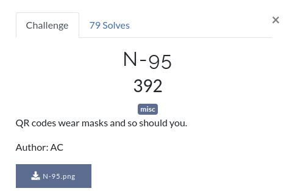
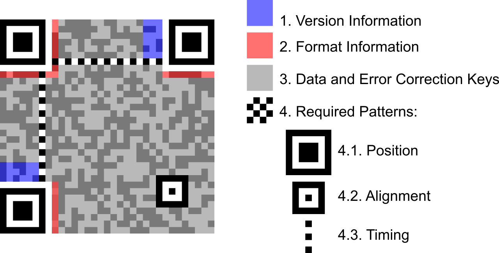
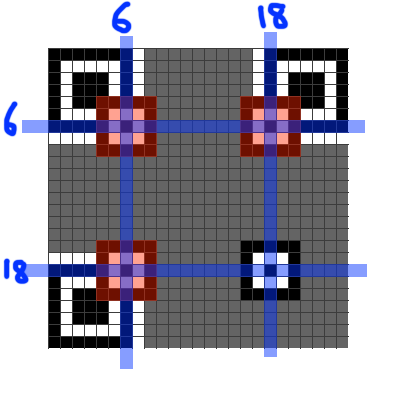
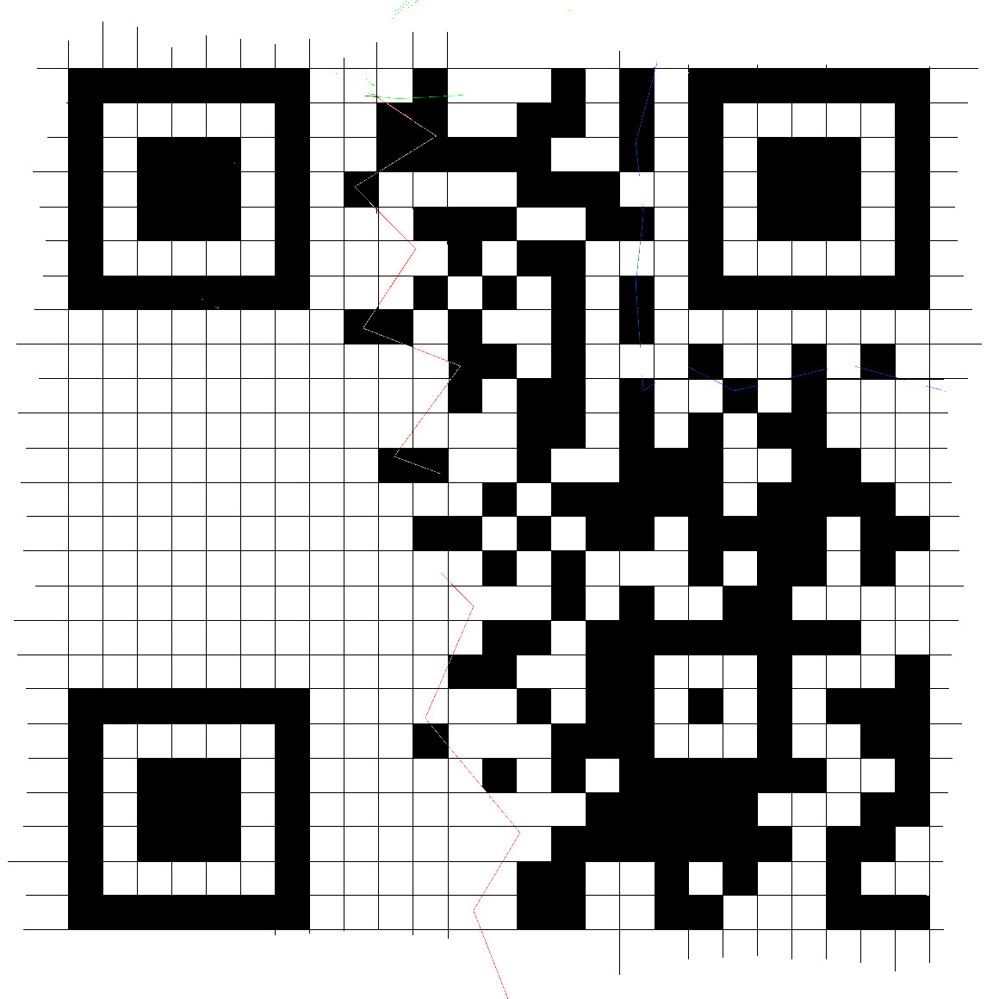
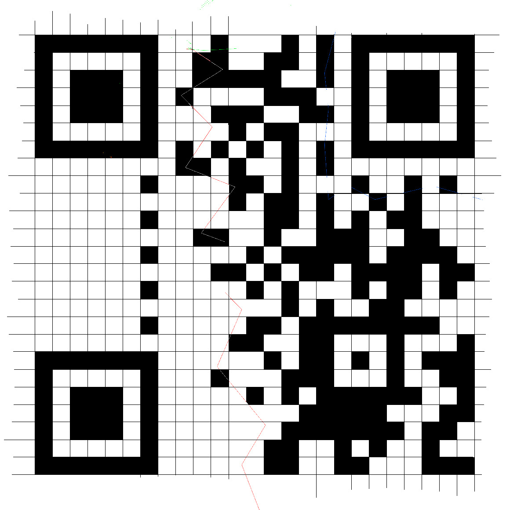

# N-95

Have you seen a QR code? Definitely. Have you seen a masked QR code? WTF!

So it appears that the QR code has been nicely painted upon. Using stegsolve, we realize that the colors are in every bit plane, so we can't just read off the QR code easily. And almost no scanner would decode this. Seems like we'll have to understand how QR codes work.

Searching for how to decode partial QRs, we stumble upon a few links -
[1](https://www.robertxiao.ca/hacking/ctf-writeup/mma2015-qrcode/), 
[2](http://blog.qartis.com/decoding-small-qr-codes-by-hand/), 
[3](https://aioo.be/2015/07/28/Decoding-a-partial-QR-code.html)

And most importantly this - [QR Code Tutorial](https://www.thonky.com/qr-code-tutorial/)

Sir @deut-erium knows how to do stuff, and so he takes up the task of editing this thing in paint, long story short, the grid stands completed and partially filled squares have been completed. Most of the further steps were also performed by sir @deut-erium orz

 Now what, reading up and checking the size of our QR code, we realize it is 25x25(version 2). 

 

 Every QR code has 3 position patterns(big squares at 3 corners - top left, bottom left and top right). Version 2 has 1 alignment pattern near bottom right, its exact position being (18,18) as shown in the figure below.

 
 Since the alignment pattern is already there, we only need to add the position patterns, which is the next step.

 

 Next we would like to add the timing patterns, those are alternate black and white pixels, one runs horizontally and the other one vertically. Adding them is our third step.

 
Version 2 has no version information, but it does have the format information. However, we're now seemingly stuck as we can only observe partial version information(infact only the last few bits). Again, the [tutorial](https://www.thonky.com/qr-code-tutorial/format-version-information) to our rescue. (Note that in QR codes, black corresponds to 1 and white to 0)

... To be completed soon