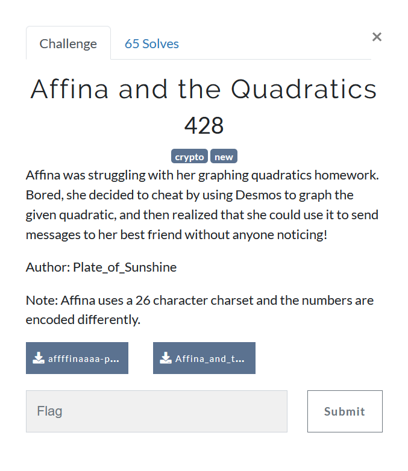
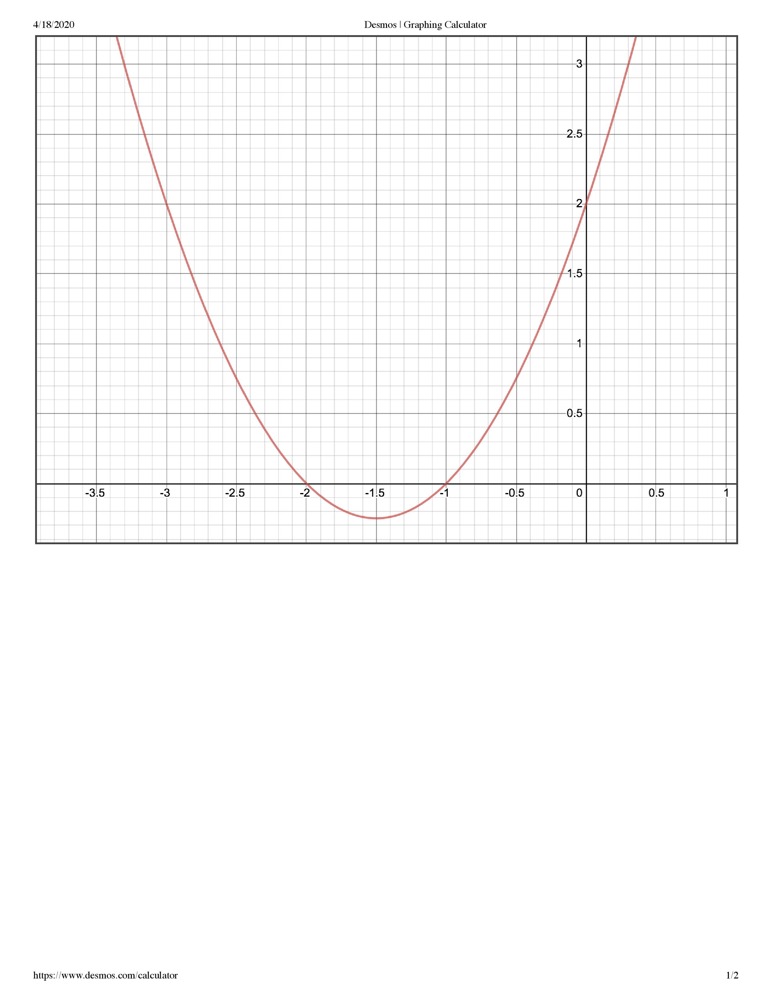

# Affina and the Quadratics



We are given this image, and hinted towards the name [Affina](https://en.wikipedia.org/wiki/Affine_cipher).


With a description reading
```
Affina was struggling with her graphing quadratics homework. Bored, she decided to cheat by using Desmos to graph the given quadratic, and then realized that she could use it to send messages to her best friend without anyone noticing!

She sent the following message to her friend: 7rr4p6_4e_4ph6bo8hap2?

Can you decrypt it using the image of the quadratic Affina used? Note: the flag should make relative sense.
```

The task is to GUESS how Affine cipher is used with respect to the quadratic `(x+1)*(x+2) = 0`

After having many GUESSES, I GUESSED that it could be simple affine cipher with mapping `3x+2 mod 26` as `(x+1)*(x+2) = x^2 + 3x + 2` as hey!, why should it be quadratic right?

But dont we have letters too? So I GUESSED we shouldnt care about them for now.  
What about underscores? GUESS that they are just word-delimiters.

```
c = 3x + 2 mod 26
c - 2 = 3x mod 26
3^-1 * (c - 2) = x mod 26
9c - 18 = x mod 26
x = 9c + 8 mod 26
```


```python
ct = "7rr4p6_4e_4ph6bo8hap2"
alpha = "rrpephbohap"
ct26 = [ chr(i) - 97 for i in alpha]
pt = [ chr((9*c + 8)%26 + 97) for c in ct26 ]
```

putting it in places, we get
`7ff4n6_4s_4nt6re8tin2`

Now why GUESS that number are encoded with the same affine cipher modulo when you can easily GUESS the flag is `4ff1n3_1s_1nt3re5tin6` :smile:

