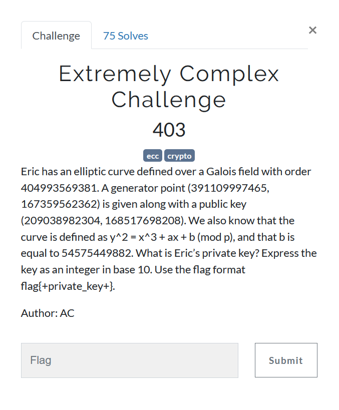

# Extremely Complex Challenge



We are given two points on an [Elliptic Curve](https://en.wikipedia.org/wiki/Elliptic-curve_cryptography#Theory), its order and parameter `b`.  
Using these quantities, we can recover parameter `a`.

```
y^2 = x^3 + ax + b (mod p)
y^2 - x^3 - b = ax (mod p)

If we have two points on curve, (x1, y1) and (x2, y2), we can get

(y1^2 - x1^3) - (y2^2 - x2^3) = a(x1 - x2)  (mod p)
a = (x1 - x2)^-1 (y1^2 - x1^3) - (y2^2 - x2^3)  (mod p)

(x1 - x2)^-1 is inverse of (x1-x2) modulo p
```

Now as we have all parameters, we can solve [ECDLP](https://en.wikipedia.org/wiki/Discrete_logarithm#Cryptography) easily since the sizes are too small.  

```python
import gmpy2

p = 404993569381
G = (391109997465, 167359562362)
P = (209038982304, 168517698208)
b = 54575449882

diff = (G[1]**2 - P[1]**2) - (G[0]**3 - P[0]**3)
diff = diff % p
a = gmpy2.invert(G[0] - P[0],p)*diff
a = a % p

E = EllipticCurve(GF(p) , [a,b])

G = E(G)
P = E(P)
PK = G.discrete_log(P)
print(PK)
G*PK == P
#17683067357
```

Altough I solved it using [SageMath](https://www.sagemath.org/), I think it can be solved on python too using relevant libraries.
