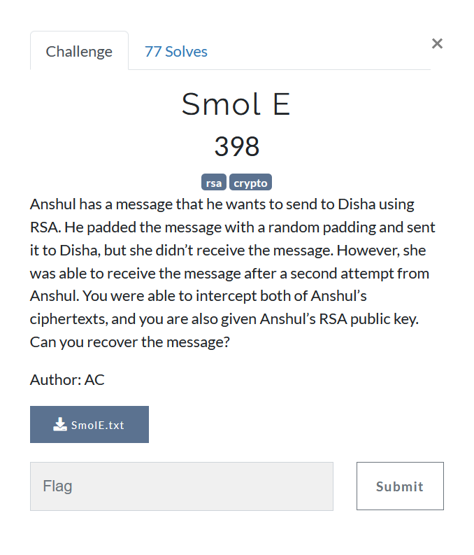

# Smol E



```
N = 163741039289512913448211316444208415089696281156598707546239939060930005300801050041110593445808590019811244791595198691653105173667082682192119631702680644123546329907362913533410257711393278981293987091294252121612050351292239086354120710656815218407878832422193841935690159084860401941224426397820742950923

E = 3

C1 = 110524539798470366613834133888472781069399552085868942087632499354651575111511036068021885688092481936060366815322764760005015342876190750877958695168393505027738910101191528175868547818851667359542590042073677436170569507102025782872063324950368166532649021589734367946954269468844281238141036170008727208883

C2 =
42406837735093367941682857892181550522346220427504754988544140886997339709785380303682471368168102002682892652577294324286913907635616629790484019421641636805493203989143298536257296680179745122126655008200829607192191208919525797616523271426092158734972067387818678258432674493723618035248340048171787246777
```

We have two ciphertexts and N, we can use [Franklin Reiter related message attack](https://crypto.stackexchange.com/questions/30884/help-understanding-basic-franklin-reiter-related-message-attack).  
But for that, we need the difference between the two messages. But since the messages are padded with a small pad, here we have another instance of [CopperSmith's Attack](https://en.wikipedia.org/wiki/Coppersmith%27s_attack). We have to use sage to solve this challenge. There are plenty of scripts for this, I used [this nice script](http://mslc.ctf.su/wp/confidence-ctf-2015-rsa1-crypto-400/)


```python
n = 163741039289512913448211316444208415089696281156598707546239939060930005300801050041110593445808590019811244791595198691653105173667082682192119631702680644123546329907362913533410257711393278981293987091294252121612050351292239086354120710656815218407878832422193841935690159084860401941224426397820742950923

e = 3

C1 = 110524539798470366613834133888472781069399552085868942087632499354651575111511036068021885688092481936060366815322764760005015342876190750877958695168393505027738910101191528175868547818851667359542590042073677436170569507102025782872063324950368166532649021589734367946954269468844281238141036170008727208883

C2 = 42406837735093367941682857892181550522346220427504754988544140886997339709785380303682471368168102002682892652577294324286913907635616629790484019421641636805493203989143298536257296680179745122126655008200829607192191208919525797616523271426092158734972067387818678258432674493723618035248340048171787246777


PRxy.<x,y> = PolynomialRing(Zmod(n))
PRx.<xn> = PolynomialRing(Zmod(n))
PRZZ.<xz,yz> = PolynomialRing(Zmod(n))

g1 = x**e - C1
g2 = (x + y)**e - C2

q1 = g1.change_ring(PRZZ)
q2 = g2.change_ring(PRZZ)

h = q2.resultant(q1)
# need to switch to univariate polynomial ring
# because .small_roots is implemented only for univariate
h = h.univariate_polynomial() # x is hopefully eliminated
h = h.change_ring(PRx).subs(y=xn)
h = h.monic()

roots = h.small_roots(X=2**60, beta=0.3)
assert roots, "Failed1"

diff = roots[0]
if diff > 2**32:
    diff = -diff
    C1, C2 = C2, C1

r = diff
R.<X> = Zmod(n)[]
f1 = X^3 - C1
f2 = (X + r)^3 - C2

# GCD is not implemented for rings over composite modulus in Sage
def my_gcd(a, b):
    return a.monic() if b == 0 else my_gcd(b, a % b)

mint=-my_gcd(f1, f2).coefficients()[0]
print(mint) # coefficient 0 = -m
print(bytes.fromhex(hex(mint>>1)[2:]))
```

Probably the most annoying part of the callenge was that pad was odd, making me think that the message is gibberish or I may be doing something wrong. Well smashing your head over something is the best part of ctf challenges I guess
