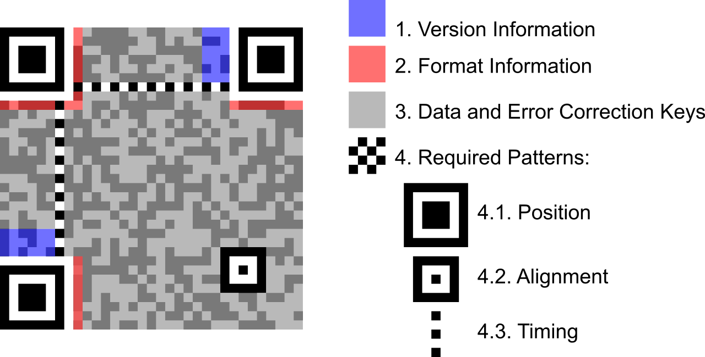
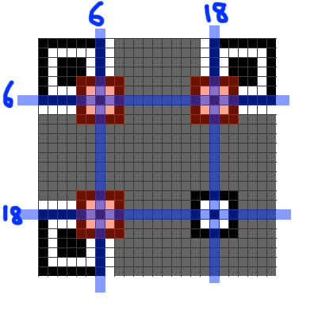

# N-95


Have you seen a QR code? Definitely. Have you seen a masked QR code? WTF!
This is one of my favorite challs from the CTF :wink:


So it appears that the QR code has been nicely painted upon. Using stegsolve, we realize that the colors are in every bit plane, so we can't just read off the QR code easily. And almost no scanner would decode this. Seems like we'll have to understand how QR codes work.

Searching for how to decode partial QRs, we stumble upon a few links -
[1](https://www.robertxiao.ca/hacking/ctf-writeup/mma2015-qrcode/), 
[2](http://blog.qartis.com/decoding-small-qr-codes-by-hand/), 
[3](https://aioo.be/2015/07/28/Decoding-a-partial-QR-code.html)

And most importantly this - [QR Code Tutorial](https://www.thonky.com/qr-code-tutorial/)

Sir @deut-erium knows how to do stuff, and so he takes up the task of editing this thing in paint, long story short, the grid stands completed and partially filled squares have been completed. Most of the further steps were also performed by sir @deut-erium orz

 Reading up and checking the size of our QR code, we realize it is 25x25(version 2). 

 

 Every QR code has 3 position patterns(big squares at 3 corners - top left, bottom left and top right). Version 2 has 1 alignment pattern near bottom right, its exact position being (18,18) as shown in the figure below.

 

 Since the alignment pattern is already there, we only need to add the position patterns, which is the next step.

 

 Next we would like to add the timing patterns, those are alternate black and white pixels, one runs horizontally and the other one vertically. Adding them is our third step.

 
Version 2 has no version information, but it does have the format information. However, we're now seemingly stuck as we can only observe partial version information(infact only the last few bits). Again, the [tutorial](https://www.thonky.com/qr-code-tutorial/format-version-information) to our rescue. (Note that in QR codes, black corresponds to 1 and white to 0). We would now like to read off our data from the QR but alas, we don't know the mask pattern. Can we obtain it somehow? Let's see!

Heading over to [qrazybox](https://merricx.github.io/qrazybox/) next, a nice and useful tool which helps with editing QRs. It allows force decode as well as data sequence analysis, which would be useful to us at the end.


In red color, the tool shows alignment and timing patterns, while in blue is shown the format infomation. One thing to observe is that the format information is stored at two places as depicted in the following pic. The numbers represent the position in the format-information string, with 0 being the MSB and 14 being the LSB(format-information is 15 bits long).


Trying to read off the format information from our reconstructed image, the first 7 bits(positton 0-6) are simply not visible :sad:, or are they? :wink:

Let's try reading the format information and inserting `?` wherever the bit is not known. We obtain `??????01??101?`. You would have to look very very carefully at the white bits, many of then seem to be white but are hidden behind the mask OwO

Let's compare this partial string with all the format information strings in the table [here](https://www.thonky.com/qr-code-tutorial/format-version-tables). Only match is `101101101001011` :grin:. This gives us ECC level as `M` and mask pattern as `3`. Setting this in [qrazybox](https://merricx.github.io/qrazybox/), we get


Using data sequence analysis in qrazybox(we don't need to worry about XOR mask since qrazybox automatically takes it into consideration), the mode is obtained as binary, and the data is 26 bits long.
Trying force decode, we obtain
```flag{60_dozen_quartz_japÓ}```

Doesn't look quite right :disappointed:.
The issue is that the last two blocks are not fully visible, and we'd have to brute force the hidden bits, meh.(We could've tried using error-correction but this approach is simpler nevertheless)


The green bits in the above image were masked originally, and hence, we don't know these bits, however, we don't need to worry about all of them, since most of them are error-correcting code blocks, and our goal is only to recover the data blocks :).


The purple block in the above image denote the second last block, which decodes to `p` and the yellow block is the last block, which decodes to `Ó`. Clearly, we only need to bruteforce 3 bits, turns out the blocks correspond to `r` and `s` respectively.
Thus, our flag can now be read off as ```flag{60_dozen_quartz_jars}```

Our final QR here:


