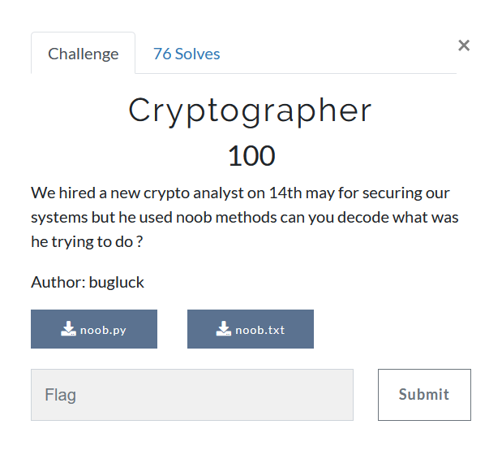

# Cryptographer



We are provided with [noob.txt](noob.txt) which has it contents:-

```
U1FEQEdeS1JDSEBEXlZDUEFYSG5ZQ29TVVBFRFlXRFxvUUJFTA==
```
and [noob.py](noob.py) which contents read
```python
#!/usr/bin/env python2
# I AM NOOB :)
import string
from hashlib import md5
from itertools import izip, cycle
import base64
import time

def xor(data, key):
    return bytearray(a^b for a, b in zip(*map(bytearray, [data, key])))

flag=""

timestamp = time.time()
print int(timestamp)
key = md5(str(int(timestamp))).hexdigest()
my_hexdata = key

scale = 16
num_of_bits = 8
noobda = bin(int(my_hexdata, scale))[2:].zfill(num_of_bits)
print noobda
xorer(flag,noobda)
noobie = base64.encodestring(xorer).strip()
print noobie
```
Hmm, python2 :disappointed: and quite a wierd script.

Without using much of my small brain, I churned up a script quickly
thinking I can bruteforce starting from current time backwards.  

But it was actually xoring the flag with two values `b'0' or b'1'`, So there are a very little number of possiblities to try.
```python
import base64
from hashlib import md5
import time

def xor(data, key):
        return bytearray(a^b for a, b in zip(*map(bytearray, [data, key])))

timestamp_initial = int(time.time())
with open('noob.txt', 'r') as ct_file:
    ct = ct_file.read().strip()

ct = base64.b64decode(ct)

for i in range(1000000):
    timestamp = timestamp_initial - i
    key = md5(str(int(timestamp))).hexdigest()
    my_hexdata = key
    scale = 16
    num_of_bits = 8
    noobda = bin(int(my_hexdata, scale))[2:].zfill(num_of_bits)
    xorer = xor(ct, noobda)
    if 'batpwn{' in xorer and '}' in xorer:
        print(xorer)
```

```
batpwn{bsxptogr`qhy^is_cd`uuigtl^ast}
batpwn{crxpunfs`phx_ir^bd`uthgum_art}
batpwn{crypuogr`qhx^is_ceatuifum^aru}
batpwn{bsxquogs`phy^hr^ceauthgul_asu}
batpwn{csypungrapix_hs_cd`tuigtl^asu}
batpwn{csxqtnfr`qix^hs^bdauthgtl^`st}
batpwn{bsyqtnfs`qix^hr_bd`uthfum^ast}
batpwn{brxquogr`qiy_hs_ceatuigtm^`st}
batpwn{bsxqtogr`qhy_hs_cdatuhgtm^aru}
batpwn{csyqungsaphx_is_cdauuhftm^`rt}
batpwn{brxqungr`qix^hr_ceauthful_aru}
batpwn{csyqtngr`phy^is_cd`tuhfum_aru}
batpwn{brxquograqix_hs^bdautigtm_`rt}
batpwn{bsxqtofsaqiy^hr_ceauuhftl_`ru}
batpwn{csxqtofsaqhy^hs^beatuhgum_ast}
batpwn{brxqunfsaqhy_is_cd`uuifum^`rt}
batpwn{brxqunfsaphx_hr_be`ttiftl_asu}
batpwn{cryqunfsaqiy_hr^ceautiful^`rt}
batpwn{brxqtngr`pix^ir_ce`utigul_`ru}
batpwn{csyqunfsaqhx^is_cdauuiftm^ast}
batpwn{bryptnfsaqhx^hr_beautigtm_asu}
batpwn{crxpuofr`phx_hr_cdautigul_aru}
batpwn{crxqungs`qhy^hr_ce`tuiful_ast}
batpwn{bryqungs`qhx_is_cd`tuhgtl_aru}
batpwn{bryqtnfr`qiy_ir_bd`tuigtl_aru}
batpwn{csxptofr`qiy^is^bdatuhgtl^`st}
batpwn{bsypunfrapix_hr^bd`uthgum_`st}
batpwn{bryptngs`qhy^hr_cdauthgtm_aru}
batpwn{csypunfsaphx_is_be`uuhgul^ast}
batpwn{csyqtogr`qhx^hr^cd`utigtm_`st}
batpwn{bsxqtofr`qiy^hs^ce`uthfum^`rt}
batpwn{csyqtofsaqix_hs_be`uthftl_`st}
batpwn{crxpunfrapiy^hr^beauthgtm_ast}
batpwn{brxptogsapix^ir_be`uthgum^aru}
batpwn{bsxptngs`qix^hr_ceatuiftl_aru}
batpwn{bsyqtogsaqhy^ir_cd`uuhful_`st}
batpwn{csxqtngs`qhx^is_cdauthgum_aru}
batpwn{brxqtograpiy^ir_ce`ttiftm_`su}
batpwn{bryptofr`qix_ir^cdatthgum_`ru}
```
HAHAHA, without using much brain, one could tell that flag is 
`batpwn{cryptography_is_beautiful_art}`
