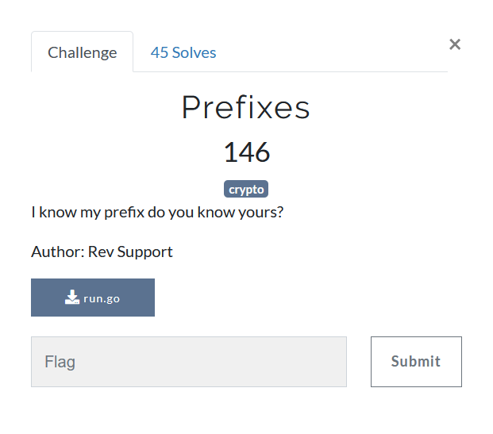

# Prefixes



```
package main

import (
    "fmt"
    "strings"
)

func charCodeAt(st string, ni int) rune {
    for i, j := range st {
        if i == ni {
            return j
        }
    }
    return 0
}

func hexify(st string) string {
    var ok string = ""
    ltr := []string{"0", "1", "2", "3", "4", "5", "6", "7", "8", "9", "a", "b", "c", "d", "e", "f"}

    for cnt := 0; cnt < len(st); cnt++ {
        ok += ltr[charCodeAt(st, cnt)>>4] + ltr[charCodeAt(st, cnt)&15]
    }

    return ok
}

func encrypt(st string) string {

    var initialize int = 0
    var ot string = ""
    var val int

    for i := 0; i < len(st); i++ {
        val = int(charCodeAt(st, i))
        initialize ^= (val << 2) ^ val
        ot += string(initialize & 0xff)
        initialize >>= 8
    }

    return strings.Replace(hexify(ot), "00", "", -1)
}

func main() {
    fmt.Println(encrypt("[REDACTED FLAG]"))
}

//Hash: eae4a5b1aad7964ec9f1f0bff0229cf1a11b22b11bfefecc9922aaf4bff0dd3c88
```

We are provided with this go file, and a hash which we have to reverse   
TBH I dont know [go](https://golang.org/), but the code is comprehendible enough in my opinion.  
Lets analyse the code chunk by chunk

```go

func charCodeAt(st string, ni int) rune {
    for i, j := range st {
        if i == ni {
            return j
        }
    }
    return 0
}
```
It should return the character value `0-255` for the character at position `ni` in string `st`

```go
func hexify(st string) string {
    var ok string = ""
    ltr := []string{"0", "1", "2", "3", "4", "5", "6", "7", "8", "9", "a", "b", "c", "d", "e", "f"}

    for cnt := 0; cnt < len(st); cnt++ {
        ok += ltr[charCodeAt(st, cnt)>>4] + ltr[charCodeAt(st, cnt)&15]
    }

    return ok
}
```
I should hexlify, i.e. return the hexadecimal representation the the string `st`

```go
func encrypt(st string) string {

    var initialize int = 0
    var ot string = ""
    var val int

    for i := 0; i < len(st); i++ {
        val = int(charCodeAt(st, i))
        initialize ^= (val << 2) ^ val
        ot += string(initialize & 0xff)
        initialize >>= 8
    }

    return strings.Replace(hexify(ot), "00", "", -1)
}
```
This should encrypt the hash obviously.  
Now looking at how it does stuff, it should be easy enough to reverse all steps. We shall begin from the last step which is  
`strings.Replace(hexify(ot), "00", "", -1)`  
Which simply replaces all occurences of `"00"` with `""` (nothing) throught (-1) from hexlified string of `ot`. Hence, we should be able to get `ot` (sans "00") from the final hash by simply hex-decoding.

Now, since we dont know the final value of `initialize`, we can reverse it from the start since we know its initial value to be `0`.

The character at position `i` is simply the `val` which produces `initialize ^ (val<<2) ^ val` with corresponding character at position `i` in `ot`

Here is a quick script to do the same
```python
ct = "eae4a5b1aad7964ec9f1f0bff0229cf1a11b22b11bfefecc9922aaf4bff0dd3c88"
ct = bytes.fromhex(ct)
flag = ""

initialize = 0
for i in range(len(ct)):
    for val in range(256):
        if (initialize ^ (val<<2)^val)&0xff == ct[i]:
            flag += chr(val)  #the value val is found
            initialize ^= (val<<2)^val  #to get the value of initialize for nex iteration of i
            initialize >>=8 # initialize is [0-3] since (val<<2)^(val) is 10 bits, which is right shifted 8 bits each iteration
            break
print(flag)
#batpwn{Ch00se_y0uR_pR3fix_w1selY}
```

I was not expecting it to give out the flag in first [go](https://golang.org/) since `00` were stripped out of the final hash.
Turns out this step was redundant. If it were not, we could simply use all 4 values of `initialize` for the places where the flag seems to not make sense.

