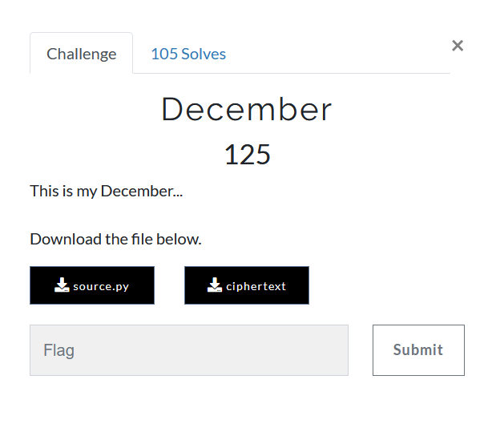
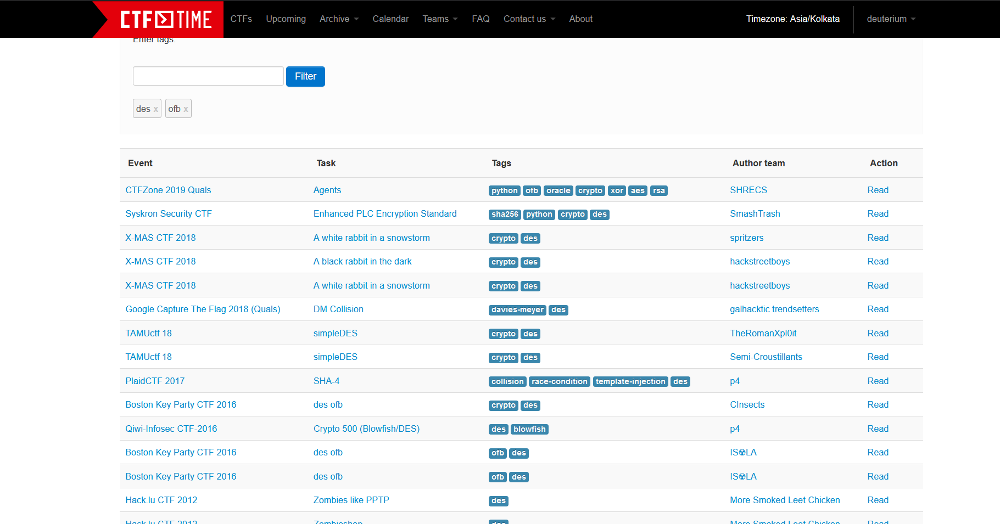
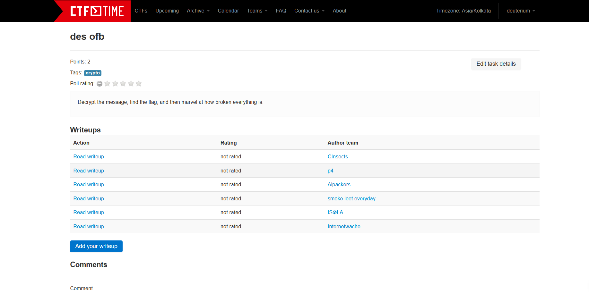

# December



We are provided with [source.py](source.py), which reads
```python
#!/usr/bin/env python

from Crypto.Cipher import DES

with open('flag.txt', 'rb') as handle:
        flag = handle.read()

padding_size = len(flag) + (8 - ( len(flag) % 8 ))
flag = flag.ljust(padding_size, b'\x00')

with open('key', 'rb') as handle:
        key = handle.read().strip()

iv = "13371337"
des = DES.new(key, DES.MODE_OFB, iv)
ct = des.encrypt(flag)

with open('ciphertext','wb') as handle:
        handle.write(ct)
```

And a binary [ciphertext](ciphertext)
```
00000000: d6a2 6fe5 c75c 22e0 5413 5e4e 1140 5d58  ..o..\".T.^N.@]X
00000010: f5ea 69f9 d419 31f7 5513 5745 5452 5e44  ..i...1.U.WETR^D
00000020: 889e 62ff d15c 2ae1 115e 5617 4141 5643  ..b..\*..^V.AAVC
00000030: e7a4 6eff cc1b 49f4 5d52 544c 455b 5a44  ..n...I.]RTLE[ZD
00000040: dda3 79c9 c310 2fcd 586c 5d52 5457 4e37  ..y.../.Xl]RTWN7
```
Which is quite unusual in the sense that most of it is readable in unusual sizes of `8`.  
This could be another instance of [Weak keys](https://en.wikipedia.org/wiki/Weak_key#Weak_keys_in_DES)  
Lets quickly run through the 4 weak keys
```python

m Crypto.Cipher import DES
with open('ciphertext', 'rb') as ct_file:
    ct = ct_file.read()

weak_keys = [
    b'\x01\x01\x01\x01\x01\x01\x01\x01',
    b'\xFE\xFE\xFE\xFE\xFE\xFE\xFE\xFE',
    b'\xE0\xE0\xE0\xE0\xF1\xF1\xF1\xF1',
    b'\x1F\x1F\x1F\x1F\x0E\x0E\x0E\x0E'
]

for key in weak_keys:
    iv = b"13371337"
    des = DES.new(key, DES.MODE_OFB, iv)
    pt = des.decrypt(ct)
    print(pt)
```

Which produces the plaintexts
```python
b'\xaf\xe0\xda\x8c=\xedG\xe4e my sno\x8c\xa8\xdc\x90.\xa8T\xf3d dreams\xf1\xdc\xd7\x96+\xedO\xe5 me pret\x9e\xe6\xdb\x966\xaa,\xf0lag{this\xa4\xe1\xcc\xa09\xa1J\xc9i_need}\x00'
b'\xb8(\xff\x82\xb0)\x06$e my sno\x9b`\xf9\x9e\xa3l\x153d dreams\xe6\x14\xf2\x98\xa6)\x0e% me pret\x89.\xfe\x98\xbbnm0lag{this\xb3)\xe9\xae\xb4e\x0b\ti_need}\x00'
b'c\xad\xc7\x9dVR$\xb2e my sno@\xe5\xc1\x81E\x177\xa5d dreams=\x91\xca\x87@R,\xb3 me pretR\xab\xc6\x87]\x15O\xa6lag{thish\xac\xd1\xb1R\x1e)\x9fi_need}\x00'
b'These are my snow covered dreams\nThis is me pretending\nflag{this_is_all_i_need}\x00'
```
 
### flag{this_is_all_i_need}

## How to solve the challenge if not aware of weak keys?




