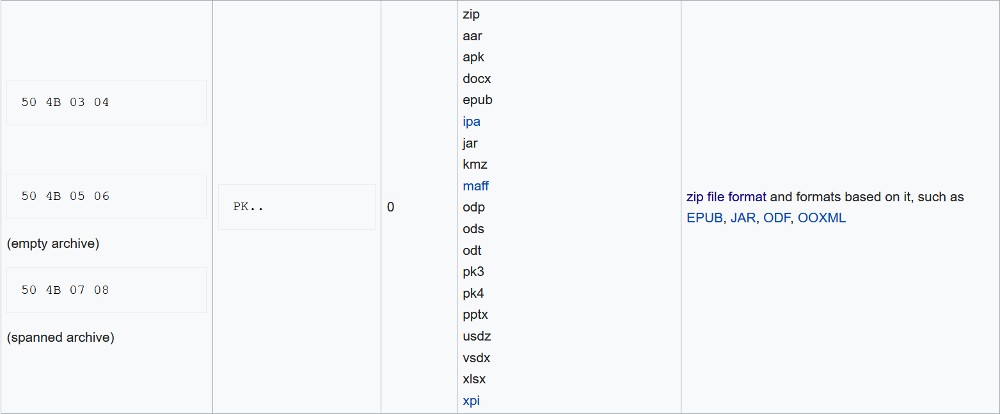

# Docxor


Getting hints from the name, one could tell, it is XOR and its about a doc.  
Still, first thing to consider is running the `file` command to see whats the [homework](homework) file is about
```
file homework
homework: data
```
Cool! this means, the `homework` file is simply XOR encryption of a `.doc` file with 4 byte key. But hey that should ring bells since the first few bytes are [file signature](https://en.wikipedia.org/wiki/List_of_file_signatures) also called magic bytes sometimes.  
Using the magic bytes, we can recover the xor key and hence the full document after xoring with the xor key.  


The magic bytes we seek are `50 4B 03 04`.
The first four bytes of the `homework` are `0a0a 9abf`, the xor key should be `0a0a9abf ^ 504b0304` = `5a4199bb` 
Lets write a quick script.  
```python
from pwn import xor

with open('homework', 'rb') as homework_file:
    homework_data = homework_file.read()

HEADER = homework_data[0:4]
MAGIC = b"\x50\x4B\x03\x04"
XOR_KEY = xor(HEADER, MAGIC)

with open('decrypted.doc', 'wb') as decrypted:
    decrypted.write(xor(XOR_KEY, homework_data))
```

This produces [decrypted.doc](decrypted.doc) which when opened looks like


### flag{xor_is_not_for_security}
