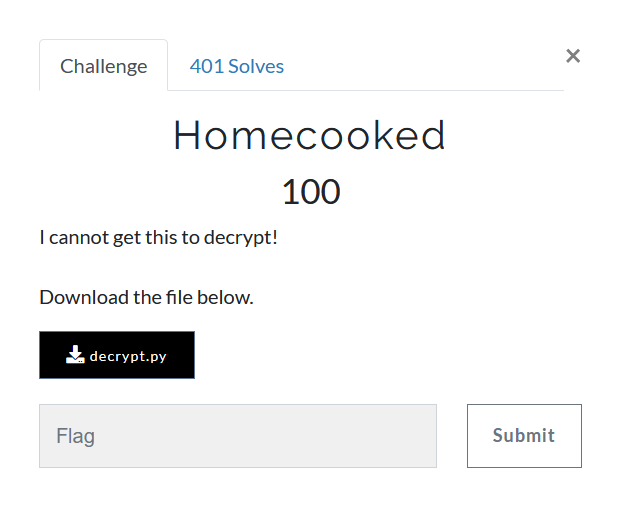

# Homecooked



We are provided [decrypt.py](decrypt.py), the contents of which read

```python
import base64
num = 0
count = 0
cipher_b64 = b"MTAwLDExMSwxMDAsOTYsMTEyLDIxLDIwOSwxNjYsMjE2LDE0MCwzMzAsMzE4LDMyMSw3MDIyMSw3MDQxNCw3MDU0NCw3MTQxNCw3MTgxMCw3MjIxMSw3MjgyNyw3MzAwMCw3MzMxOSw3MzcyMiw3NDA4OCw3NDY0Myw3NTU0MiwxMDAyOTAzLDEwMDgwOTQsMTAyMjA4OSwxMDI4MTA0LDEwMzUzMzcsMTA0MzQ0OCwxMDU1NTg3LDEwNjI1NDEsMTA2NTcxNSwxMDc0NzQ5LDEwODI4NDQsMTA4NTY5NiwxMDkyOTY2LDEwOTQwMDA="

def a(num):
    if (num > 1):
        for i in range(2,num):
            if (num % i) == 0:
                return False
                break
        return True
    else:
        return False

def b(num):
    my_str = str(num)
    rev_str = reversed(my_str)
    if list(my_str) == list(rev_str):
       return True
    else:
       return False


cipher = base64.b64decode(cipher_b64).decode().split(",")

while(count < len(cipher)):
    if (a(num)):
        if (b(num)):
            print(chr(int(cipher[count]) ^ num), end='', flush=True)
            count += 1
            if (count == 13):
                num = 50000
            if (count == 26):
                num = 500000
    else:
        pass
    num+=1

print()
```
Here two functions `a` and `b` are of primary focus,
```python
def a(num):
    if (num > 1):
        for i in range(2,num):  #From all numbers from 2 to num - 1
            if (num % i) == 0:  #check if the number i divides num
                return False    #if it divides, then its composite
                break
        return True  # No such number found hence prime
    else:
        return False
```
Seems like, its looping over all possible numbers to check if the provided number `num` is a prime or not

```python
def b(num):
    my_str = str(num) # string representation of number
    rev_str = reversed(my_str)  # reverse the string
    if list(my_str) == list(rev_str): # check if both equal
       return True  # the input is a palindrome
    else:
       return False
```
This function just checks if `num` is a [palindrome](https://en.wikipedia.org/wiki/Palindrome)

The `cipher_b64` is simply a base64 encoding of a comma separated list of numbers
```
100,111,100,96,112,21,209,166,216,140,330,318,321,70221,70414,70544,71414,71810,72211,72827,73000,73319,73722,74088,74643,75542,1002903,1008094,1022089,1028104,1035337,1043448,1055587,1062541,1065715,1074749,1082844,1085696,1092966,1094000
```

It is simply taking number from the list and xoring with next prime-palindrome to give the character in sets of 13. Lets simply run the `decrypt.py` to see what happens

```
python3 decrypt.py
flag{pR1m3s_4re_co0ler_Wh3
```
Hmm, seems stuck. What's the issue?  
The issue is with function `a` which checks for prime by dividing it by all numbers.  
This can be done pretty efficiently by better [primality tests](https://en.wikipedia.org/wiki/Primality_test).  
One could simply use `is_prime` from `gmpy2` library of python and replace the function `a`

```python
import base64
import gmpy2
num = 0
count = 0
cipher_b64 = b"MTAwLDExMSwxMDAsOTYsMTEyLDIxLDIwOSwxNjYsMjE2LDE0MCwzMzAsMzE4LDMyMSw3MDIyMSw3MDQxNCw3MDU0NCw3MTQxNCw3MTgxMCw3MjIxMSw3MjgyNyw3MzAwMCw3MzMxOSw3MzcyMiw3NDA4OCw3NDY0Myw3NTU0MiwxMDAyOTAzLDEwMDgwOTQsMTAyMjA4OSwxMDI4MTA0LDEwMzUzMzcsMTA0MzQ0OCwxMDU1NTg3LDEwNjI1NDEsMTA2NTcxNSwxMDc0NzQ5LDEwODI4NDQsMTA4NTY5NiwxMDkyOTY2LDEwOTQwMDA="

def a(num):
    return gmpy2.is_prime(num)


def b(num):
    return str(num) == str(num)[::-1]

cipher = base64.b64decode(cipher_b64).decode().split(",")

while(count < len(cipher)):
    if (a(num)):
        if (b(num)):
            print(chr(int(cipher[count]) ^ num), end='', flush=True)
            count += 1
            if (count == 13):
                num = 50000
            if (count == 26):
                num = 500000
    else:
        pass
    num+=1

print()
```
Now running [solve.py](solve.py) spews the flag instantly

### flag{pR1m3s_4re_co0ler_Wh3n_pal1nDr0miC}
