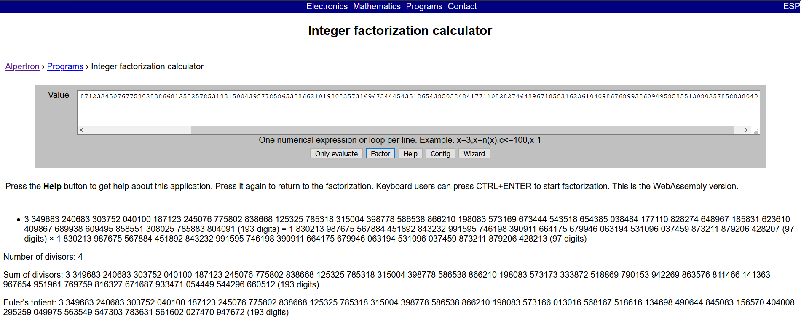

# Ooo-la-la


We are provided [prompt.txt](prompt.txt), the contents of which read
```
N = 3349683240683303752040100187123245076775802838668125325785318315004398778586538866210198083573169673444543518654385038484177110828274648967185831623610409867689938609495858551308025785883804091
e = 65537
c = 87760575554266991015431110922576261532159376718765701749513766666239189012106797683148334771446801021047078003121816710825033894805743112580942399985961509685534309879621205633997976721084983
```
Seems like usual RSA, lets see if we can factor `N` over [alpetron](https://www.alpertron.com.ar/ECM.HTM) 


Which almost instantly factors the `N` using [Elliptic Curve Method](https://en.wikipedia.org/wiki/Lenstra_elliptic-curve_factorization)  

Knowing the factors or phi, rest of the job is easy
```python
from gmpy2 import invert
p = 1830213987675567884451892843232991595746198390911664175679946063194531096037459873211879206428207
q = 1830213987675567884451892843232991595746198390911664175679946063194531096037459873211879206428213

N = 3349683240683303752040100187123245076775802838668125325785318315004398778586538866210198083573169673444543518654385038484177110828274648967185831623610409867689938609495858551308025785883804091
e = 65537
c = 87760575554266991015431110922576261532159376718765701749513766666239189012106797683148334771446801021047078003121816710825033894805743112580942399985961509685534309879621205633997976721084983

d = invert(e, (p-1)*(q-1))

pt = pow(c,d,N)
print(bytes.fromhex(hex(pt)[2:]).decode())
```

### flag{ooo_la_la_those_are_sexy_primes}
