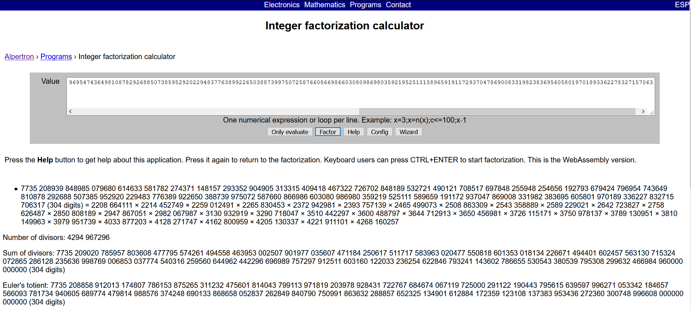

# Raspberry


We are provided with [prompt.txt](prompt.txt), the contents of which read
```
n = 7735208939848985079680614633581782274371148157293352904905313315409418467322726702848189532721490121708517697848255948254656192793679424796954743649810878292688507385952920229483776389922650388739975072587660866986603080986980359219525111589659191172937047869008331982383695605801970189336227832715706317
e = 65537
c = 5300731709583714451062905238531972160518525080858095184581839366680022995297863013911612079520115435945472004626222058696229239285358638047675780769773922795279074074633888720787195549544835291528116093909456225670152733191556650639553906195856979794273349598903501654956482056938935258794217285615471681
```

Lets again head to [alpetron](https://www.alpertron.com.ar/ECM.HTM), suspecting there may be a lot of small prime factors



Which almost instantly factors the `N` using [Elliptic Curve Method](https://en.wikipedia.org/wiki/Lenstra_elliptic-curve_factorization) indicating my suspicion was true.

Now we have a lot of prime factors, one may simply grab the Euler's Totient, I however prefer working over primes to demonstrate how its calculated

```python
from gmpy2 import invert
from math import prod
n = 7735208939848985079680614633581782274371148157293352904905313315409418467322726702848189532721490121708517697848255948254656192793679424796954743649810878292688507385952920229483776389922650388739975072587660866986603080986980359219525111589659191172937047869008331982383695605801970189336227832715706317
e = 65537
c = 5300731709583714451062905238531972160518525080858095184581839366680022995297863013911612079520115435945472004626222058696229239285358638047675780769773922795279074074633888720787195549544835291528116093909456225670152733191556650639553906195856979794273349598903501654956482056938935258794217285615471681

factors = [2208664111,2214452749,2259012491,2265830453,2372942981,2393757139,2465499073,2508863309,2543358889,2589229021,2642723827,2758626487,2850808189,2947867051,2982067987,3130932919,3290718047,3510442297,3600488797,3644712913,3650456981,3726115171,3750978137,3789130951,3810149963,3979951739,4033877203,4128271747,4162800959,4205130337,4221911101,4268160257]

phi = prod(i-1 for i in factors) # cool new function in python3.8 ;)
# just take the product of prime - 1 for all primes to calculate phi
# since no prime is repeated
d = invert(e,phi)
m = pow(c,d,n)
print(bytes.fromhex(hex(m)[2:]).decode())
```

If you got stuck over the challenge, I would suggest reading [wikipedia](https://en.wikipedia.org/wiki/Euler%27s_totient_function) for more information.  
### flag{there_are_a_few_extra_berries_in_this_one}
