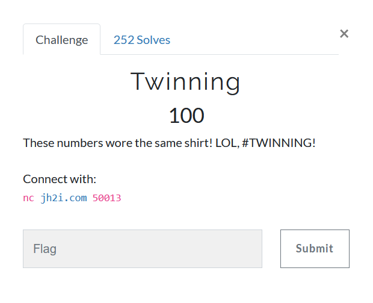

# Twinning



The name of the challenge is a subtle hint towards [Twin primes](https://en.wikipedia.org/wiki/Twin_prime), i.e. the RSA primes `p` and `q` being twin primes, at a difference of two.  

How does that help?  
We can now easily factor `n` since we have another relation, namely
```
q = p + 2 and  
p*q = N  
q^2 - q*p = N
( q - 1 )^2 = N + 1
q = sqrt( N + 1 ) + 1
p = sqrt( N + 1 ) - 1  
```

One can easily solve a quadratic equation to find `p`  
Once `p` and `q` are found, rest is a piece of cake

Although the time was not a concern, I still wrote a small script
```python
from pwn import remote
import gmpy2
import re

HOST, PORT = "jh2i.com", 50013
REM = remote(HOST, PORT)

data = REM.recvuntil(b'What is the PIN?')
print(data.decode())
e_n = re.search(b'(\d+),(\d+)',data)
e = int(e_n[1])
n = int(e_n[2])
PIN = int(re.search(b'is (\d+)',data)[1])

def factor(n,e):
    a = gmpy2.iroot(n+1,2)[0]
    phi = (a-2)*(a)
    return gmpy2.invert(e,phi) # returns d

DECRYPTED_PIN = pow(PIN, factor(n,e), n)
REM.sendline(str(DECRYPTED_PIN).encode())
print(REM.recvline().decode())
print(REM.recvline().decode())
print(REM.recvline().decode())
```

### flag{thats_the_twinning_pin_to_win}
