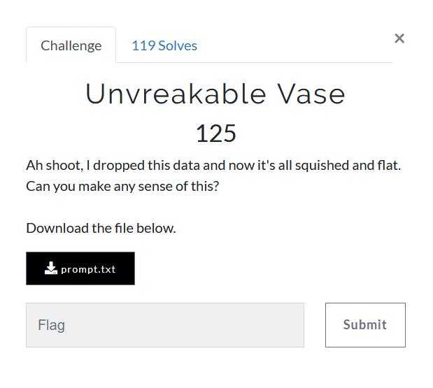

# Unvreakable Vase



We are provided with [prompt.txt](prompt.txt), which reads
```
zmxhz3tkb2vzx3roaxnfzxzlbl9jb3vudf9hc19jcnlwdg9vb30=
```
This seems to be base64 encoded but I think all the letters are converted to lowercase as hinted by `squished and flat`  

```python
import base64
data = 'zmxhz3tkb2vzx3roaxnfzxzlbl9jb3vudf9hc19jcnlwdg9vb30='
m1 = base64.b64decode(data)
print(m1)

#b'\xcela\xcf{dok\xf3\xc7z\xe8k\x19\xdf\xcf\x1c\xe5n_co{\xeeu\xffas_crypv\x0foo}'
```
Lets try captilizing the first 'z'
```python
import base64
data = 'zmxhz3tkb2vzx3roaxnfzxzlbl9jb3vudf9hc19jcnlwdg9vb30='
m1 = base64.b64decode(data)
print(m1)

#b'fla\xcf{dok\xf3\xc7z\xe8k\x19\xdf\xcf\x1c\xe5n_co{\xeeu\xffas_crypv\x0foo}'
```
Seems to be it, now our flag begins with `fla`.  
All we need to do is keep capitalizing the letters of `data` such that base64 decoding results in a ASCII string which is readable.

One can do this by hand. NOT ME :stuck_out_tongue:

To automate this shit, lets take a look at how base64 actually works.  
In base64, we have 64 possible characters, which means each base64 letter can hold 6 bits.  
Which in turn means 4 base64 characters = 24 bits = 3 bytes  
So instead of taking all 52 characters of `prompt` together and then checking `2**52` possibilities, we can simply take 4 characters at a time, and thenn checking `2**4` possibilites for output in the desired character set.  

```python
from base64 import b64decode as decode
from itertools import product

data = 'zmxhz3tkb2vzx3roaxnfzxzlbl9jb3vudf9hc19jcnlwdg9vb30='
CHARSET = 'abcdefghijklmnopqrstuvwxyz_{}'


def case_variations(string):
    possibilities = []
    for char in string:
        possibilities.append([char.lower(), char.upper()])
    return ["".join(perm) for perm in product(*possibilities)]


flag = b""
real_data = ""
for i in range(0, len(data), 4):
    crib = data[i:i + 4]
    for case_variation in case_variations(crib):
        if all(chr(char) in CHARSET for char in decode(case_variation)):
            real_data += case_variation
            flag += decode(case_variation)
            print(flag)
            break

print(real_data)
```
Which prints out stuff
```python
b'fla'
b'flag{d'
b'flag{does'
b'flag{does_th'
b'flag{does_this_'
b'flag{does_this_eve'
b'flag{does_this_even_c'
b'flag{does_this_even_coun'
b'flag{does_this_even_count_a'
b'flag{does_this_even_count_as_c'
b'flag{does_this_even_count_as_cryp'
b'flag{does_this_even_count_as_cryptoo'
b'flag{does_this_even_count_as_cryptooo}'
ZmxhZ3tkb2VzX3RoaXNfZXZlbl9jb3VudF9hc19jcnlwdG9vb30=
```

And our original base64 encoded string was `'ZmxhZ3tkb2VzX3RoaXNfZXZlbl9jb3VudF9hc19jcnlwdG9vb30='`
### flag{does_this_even_count_as_cryptooo}
