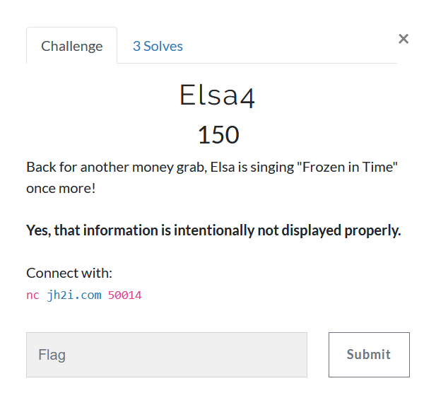

# Elsa4



Apparently, its an instance of [LC4](https://github.com/dstein64/LC4/blob/master/documentation.md) cipher.  
We are provided with a subtle hint `Frozen in time` which could mean `random` is seeded with the present time, confirmed by the fact that time is provided at the start of the challenge.  

Now, all we need to figure out is the length of nonce, however it is implemented.

I also wrote `encrypt`, `decryption_challenge`, `send_decryption` utilities, which would encrypt a given message from server, ask for a decryption challenge and send the decryption of given decryption challenge respectively to the server.

```python
from pwn import remote
import re
import datetime
import random
import lc4
HOST, PORT = "jh2i.com", 50014

REM = remote(HOST, PORT)
initial_data = REM.recvuntil(b'>')
print(initial_data.decode())


def get_timestamp():
    hms = re.search(rb'(\d{2}):(\d{2}):(\d{2})', initial_data)
    ymd = re.search(rb'(\d{4})\/(\d{2})\/(\d{2})', initial_data)
    h, m, s = hms[1], hms[2], hms[3]
    y, mn, d = ymd[1], ymd[2], ymd[3]
    return map(int, tuple((y, mn, d, h, m, s)))


timestamp = datetime.datetime(*get_timestamp()).timestamp()
random.seed(int(timestamp))

nonce_length = 100  # some big number
alphabet = "#_23456789abcdefghijklmnopqrstuvwxyz"
nonce_chars = []
for _ in range(nonce_length):
    nonce_chars.extend(random.sample(alphabet, 1))


def encrypt(plaintext):
    REM.sendline(b'1')
    REM.sendline(plaintext)
    data = REM.recvuntil(b'>')
    key = re.search(
        b'Key = ([#_23456789abcdefghijklmnopqrstuvwxyz]+)',
        data)[1]
    encrypted = re.search(
        b'Encrypted = ([#_23456789abcdefghijklmnopqrstuvwxyz]+)',
        data)[1]
    return key, encrypted


def decryption_challenge():
    REM.sendline(b'2')
    data = REM.recvuntil(b'Decrypted =')
    key = re.search(
        b'Key = ([#_23456789abcdefghijklmnopqrstuvwxyz]+)',
        data)[1]
    encrypted = re.search(
        b'Encrypted = ([#_23456789abcdefghijklmnopqrstuvwxyz]+)',
        data)[1]
    return key, encrypted


def send_decryption(dec):
    REM.sendline(dec)
    data = REM.recvuntil(b'>')
    print(data.decode())
```

The only concern I am left with is **HOW IS THE NONCE USED!!?**  
To be honest, I am fed up of all the [snake oil](https://en.wikipedia.org/wiki/Snake_oil_(cryptography)) in ctf challenges.  
Take the challenge, give out the source, make it challenging :smile:
