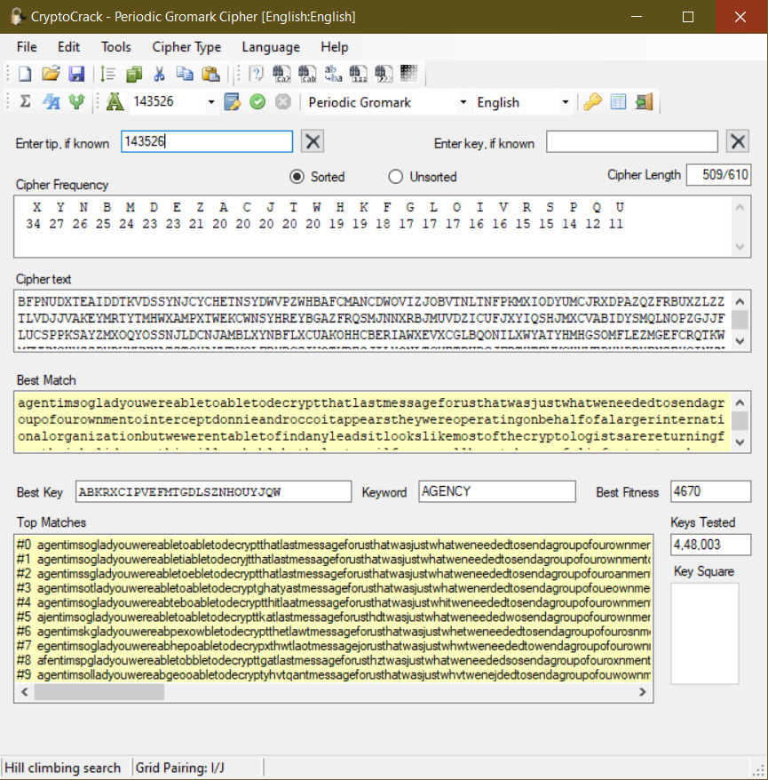

# 06
```
It looks like someone already tried to crack this message, but they destroyed all their work. They used a naff shredder though, and we were able to recover the number 143526.

BFPNU DXTEA IDDTK VDSSY NJCYC
HETNS YDWVP ZWHBA FCMAN CDWOV
IZJOB VTNLT NFPKM XIODY UMCJR
XDPAZ QZFRB UXZLZ ZTLVD JJVAK
EYMRT YTMHW XAMPX TWEKC WNSYH
REYBG AZFRQ SMJNN XRBJM UVDZI
CUFJX YIQSH JMXCV ABIDY SMQLN
OPZGJ JFLUC SPPKS AYZMX OQYOS
SNJLD CNJAM BLXYN BFLXC UAKOH
HCBER IAWXE VXCGL BQONI LXWYA
TYHMH GSOMF LEZMG EFCRQ TKWMF
VWNGH XZZPX RWYWN NATZT GYAKV
BKGLF BYBCZ IWOTK BEQJI LXONL
TCYET BUDGJ FBTHT EVKCH XVEDX
XPBXE NZEYG INKNM KYWXT XNEMO
AOCRG XBGXQ XYWHQ IYXBO BEVDG
ADNXT DFDYD GCFZN KGHHD WQKXY
CFJII GSDJV FREIW QMNYP MXMKZ
IZRBO BHDRB EASHY NXZXS GEHPE
PMVLK WXEUU KAOMW OWJFD LBKHE
RLPAR JMJU
```
Watch [this video](https://www.youtube.com/watch?v=9Q5Q1Nn5Vss) for a way better analysis, I am probably dead by writing [14 writeups](https://github.com/deut-erium/WriteUps/tree/master/ractf/crypto) in a go.

Checking out [cipher statistics](https://bionsgadgets.appspot.com/gadget_forms/refscore_extended.html) the result cipher appears to be gromark cipher or periodic gromark cipher, but is actually periodic gromark cipher.

Churning out cryptocrack with same key and primer `143526`, we get our plaintext



```
agentimsogladyouwereabletoabletodecryptthatlastmessageforusthatwasjustwhatw
eneededtosendagroupofourownmentointerceptdonnieandroccoitappearstheywereope
ratingonbehalfofalargerinternationalorganizationbutwewerentabletofindanylea
dsitlookslikemostofthecryptologistsarereturningfromtheirholidayssothiswillp
robablybethelastemailfrommewellhavetobecarefulinfurturetomakesuretheirleave
neverlinesuplikethatagainagentbpsifyoueverwanttotransfertothecipherdepartme
ntidbehappytoputanameinforyouppsthesecretcodeisorganization
```
Beautifying a bit
```
agent i m so glad you were able to able to decrypt that last message for 
us that was just what we needed to send a group of our own men to 
intercept donnie and rocco it appears they were operating on behalf of a 
larger international organization but we werent able to find any leads it
looks like most of the cryptologists are returning from their holidays so 
this will probably be the last email from me well have to be careful in 
furture to make sure their leave never lines up like that again agent bps 
if you ever want to transfer to the cipher department id be happy to put 
a name in for you pps the secret code is organization
```
We get our flag
#### ORGANIZATION
