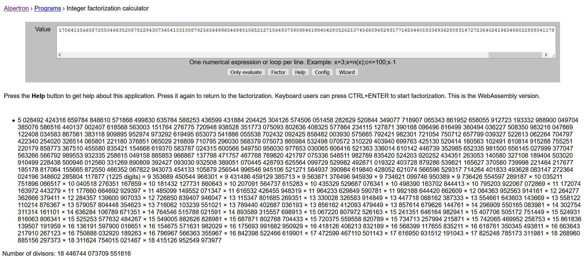

# 4k-rsa

## Description
```
Only n00bz use 2048-bit RSA. True gamers use keys that are at least 4k bits long, no matter how many primes it takes...
```

## Files
[4k-rsa-public-key.txt](./4k-rsa-public-key.txt) which contains a `n, e, c` triple

Seems like there are a lot of primes in the factorization of `n`, since the factorization process is influenced directly by the size of prime factors and not the size of the number being factored itself, it should be fairly doable by [alpetron.ar](https://www.alpertron.com.ar/ECM.HTM)



It took about half an hour to factor, one may engage to other activities or alternatively try if the factors are available on [factordb](http://factordb.com/).  
Anyways, once finished factoring, alpetron produces both the [factors](./factors) and the Euler's totient `phi` which will be used to compute `d`

```
d = pow(e,-1,phi) # on python3.8
# or gmpy2.invert(e,phi) 
m = pow(c,d,n)
print(bytes.fromhex(hex(m)[2:]).decode())
```
And hurray, we have our flag

### flag{t0000_m4nyyyy_pr1m355555}


