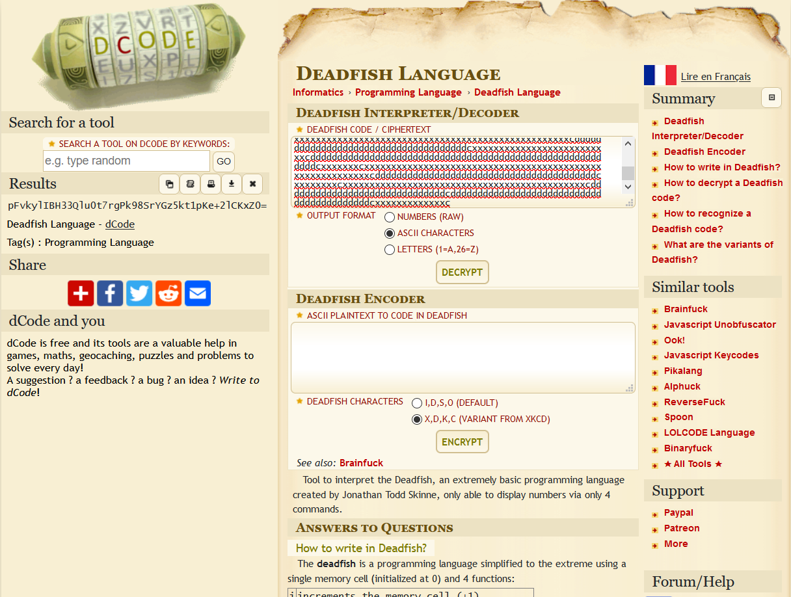
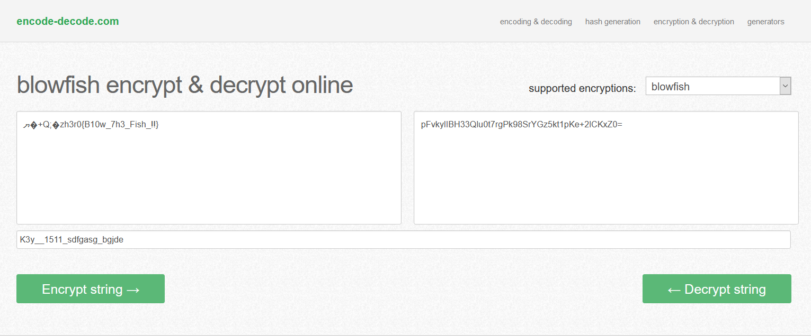

# Double Fish

## Description
```
There two fishes in the Xander's Operative Register
A flag is waiting for you when you catch both.

_0m\K2!2%\ggrdups\vd~gq


Author : Finch
```

## Challenge Files
- [chall.txt](chall.txt)

```bash
cat chall.txt
xxkxxxxkxxxxxxxxxxxxxxxxxxxxxxxxxxxxxxxxxxxxxxxxxxxxxxxxcddddddddddddddddddddddddddddddddddddddddddcxxxxxxxxxxxxxxxxxxxxxxxxxxxxxxxxxxxxxxxxxxxxxxxxcdddddddddddcxxxxxxxxxxxxxxcdddddddddddddcdddddddddddddddddddddddddddddddddddcdddddddcxxxxxxcdddddddddddddddddddddccxxxxxxxxxxxxxxxxxxxxxxxxxxxxxxcxxxxxxxxxxxxxxxxxxxxxxxxxxxcxxxxxxxxxcdddddddddddddddddddddddddddddddddddddddddddddddddddddddddddddddddddddcxxxxxxxxxxxxxxxxxxxxxxxxxxxxxxxxxxxxxxxxxxxxxxxxxxxxxxxxxxxxxxxxxxxxcdddddddddddddddddddddddddddddddddddddddddddddddddddddddddddddcxxxxxxxxxxxxxxxxxxxxxxxxxxxxxxxxxxxxxxxxxxxxxxxxxxxxxxxxxxxcdddddddddddcdddddddddddddddddddddddcxxxxxxxxxxxxxxxxxxxxxxxxxxxcddddddddddddddddddddddddddddddddddddddddddddddddddcdcxxxxxxxxxxxxxxxxxxxxxxxxxxxcxxxxxxxxxxxxxxxxxxxxxxxxxxxxxxxcdddddddddddddddddddddddddcddddddddddddddddddcxxxxxxxxxxxxxxxxxxxxxxxxxxxxxxxxxxxxxxxxxxxxxxxxxxxcdddddddddddddddddddddddddddddddddddddddddddddddddddddddddddddddddddddcxxxxxxxxxxxxxxxxxxxxxxxxxxxxxxxxxxxxxxxxxxxxxxxxxxxxxxcxxxxxxxxxcdddddddddddddddddddddddddddddddddddddddddddddddddddddddddddddddddddcxxxxxxxxxxxxxxxxxxxxxxxxxxxxxxxxxxxxxxxxxxxxxxxxxxxxxxxxxxxxxxxcdddddddddddddddddddddddddddddddddddddcxxxxxxxxxxxxxxxxxxxxxxxxxxcddddddddddddddddddddddddddddddddddddddddddddddddddddddddddcxxxxxxxcxxxxxxxxxxxxxxxxxxxxxxxxxxxxxxxxxxxxxxxxxxxxxxxxxxxxxxxxxxcdddddddddddddddddddddddddddddddddddddddddcxxxxxxxxcxxxxxxxxxxxxxxxxxxxxxxxxxxxxxxxxxxxxxxxxxxxxxcddddddddddddddddddddddddddddddcddddddddddddddddddddddddddddddddddddddddddcxxxxxxxxxxxxxc
```

Now, this is very **GUESSY** as it is Deadfish esolang, whose interpreter I found at [dcode.fr](https://www.dcode.fr/deadfish-language)  


The decoded string comes out to be `pFvkylIBH33Qlu0t7rgPk98SrYGz5kt1pKe+2lCKxZ0=` which looks to be the ciphertext or maybe key

Again, whats up with `_0m\K2!2%\ggrdups\vd~gq` part? There may be XOR included taking a hint from `Xander's Operative Register`  

Now, I couldnt solve this challenge in the ctf, the stuff was soo guessy. This part is written post ctf from discussions.  

Someone said xoring `_0m\K2!2%\ggrdups\vd~gq` with the key `0x143` gave us the key `K3y__1511_sdfgasg_bgjde`, which is the key to Blowfish cipher. We can get the flag using [this site](https://encode-decode.com/blowfish-encrypt-online/)  



and we get the flag

### zh3r0{B10w_7h3_Fish_!!}

## Wait, i have too many questions

I wrote [this script](solve.py) to bruteforce the XOR
```python
cat solve.py
import string
from itertools import product
k = '_0m\K2!2%\ggrdups\vd~gq'

def xor(str1, str2):
    """perform string xor on str1 and str2 and return string"""
    len_1 = len(str1)
    len_2 = len(str2)
    if len_1 >=len_2:
        return "".join(chr(ord(str1[i])^ord(str2[i%len_2])) for i in range(len_1) )
    else:
        return "".join(chr(ord(str1[i%len_1])^ord(str2[i])) for i in range(len_2) )


for keysize in range(1,3):
    possible_keys = []
    for key_pos in range(keysize):
        current_keys = []
        for ch in range(256):
            if all( i in string.printable[:95] for i in xor(chr(ch), k[key_pos::keysize] )):
                current_keys.append(chr(ch))
        possible_keys.append(current_keys)
    for key in product(*possible_keys):
        print(xor(k,"".join(key)))
```
**No results are produced**  
No reasonable results are produced with key size above 3 (there are too many valid decryptions)  
I tried testing the `0x143` key, which would be `\x14\x31\x43`, and it produces, `'K\x01NHz\x115\x03\x06HVDfUVdB(pODe'`. Hmm, nothing meaningful either  
So I tested `\x14\x03`, which produces `'K3y__1511_sdfgasg\x08p}sr'`  
Which is clearly not the one I get. Moreover, no python module produced valid blowfish decryption. Why is the challenge so **GUESSY**

I seek relief :) 

## Clarified, thanks @jack
### Issue with the key
The key was indeed `0x1403`, **NOT** `0x143`, its the weird way how CyberChef interprets `0x143` into `0x1403` which could have made the author into beliving that the key ix `0x143` :)

### Whats the issue with the key above?
I completely missed the point that the ciphertext contains `\v` in it, hence it interprets it as special escaped character for [vertical tab](https://stackoverflow.com/questions/3380538/what-is-a-vertical-tab) and hence I was getting wrong decryptions.  

Fixing my [solve.py](solve.py) script, I indeed get a lot of valid decryptions now :)

### Whats up with blowfish?
It was not very evident which mode of blowfish was used. Spending some time, I found it was CBC mode and was just a matter of IV
I tested out in two different modules   
[blowfish](https://pypi.org/project/blowfish/)
```python
import blowfish
import base64
key = b'K3y__1511_sdfgasg_bgjde'
ct = base64.b64decode('pFvkylIBH33Qlu0t7rgPk98SrYGz5kt1pKe+2lCKxZ0=')
b = blowfish.Cipher(key)
b''.join(b.decrypt_cbc(ct[8:],ct[:8]))
```
Or alternatively using [pycryptodome](https://pycryptodome.readthedocs.io/en/latest/src/cipher/blowfish.html)  
```python
from Crypto.Cipher import Blowfish
key = b'K3y__1511_sdfgasg_bgjde'
ct = base64.b64decode('pFvkylIBH33Qlu0t7rgPk98SrYGz5kt1pKe+2lCKxZ0=')
B = Blowfish.new(key,Blowfish.MODE_CBC,ct[:8])
B.decrypt(ct[8:])
```
Which produces correct plaintext!!  
There is still something funky about blowfish, which needs to be figured out
```python
B.decrypt(ct[8:])
b'zh3r0{B10w_7h3_Fish_!!}\x01'
>>> B.decrypt(ct[8:])
b'z\x94ib2\xf0\x98\xd10w_7h3_Fish_!!}\x01'
>>> B.decrypt(ct[8:])
b'z\x94ib2\xf0\x98\xd10w_7h3_Fish_!!}\x01'
>>> B.decrypt(ct[8:])
b'z\x94ib2\xf0\x98\xd10w_7h3_Fish_!!}\x01'
>>> B.decrypt(ct[8:])
b'z\x94ib2\xf0\x98\xd10w_7h3_Fish_!!}\x01'
>>> B.decrypt(ct[8:])
b'z\x94ib2\xf0\x98\xd10w_7h3_Fish_!!}\x01'
>>> B.decrypt(ct[8:])
b'z\x94ib2\xf0\x98\xd10w_7h3_Fish_!!}\x01'
>>> B.decrypt(ct[8:])
b'z\x94ib2\xf0\x98\xd10w_7h3_Fish_!!}\x01'
```
It produces correct decryption only once, the first block seems corrupted later on.  
Clarification time :)


