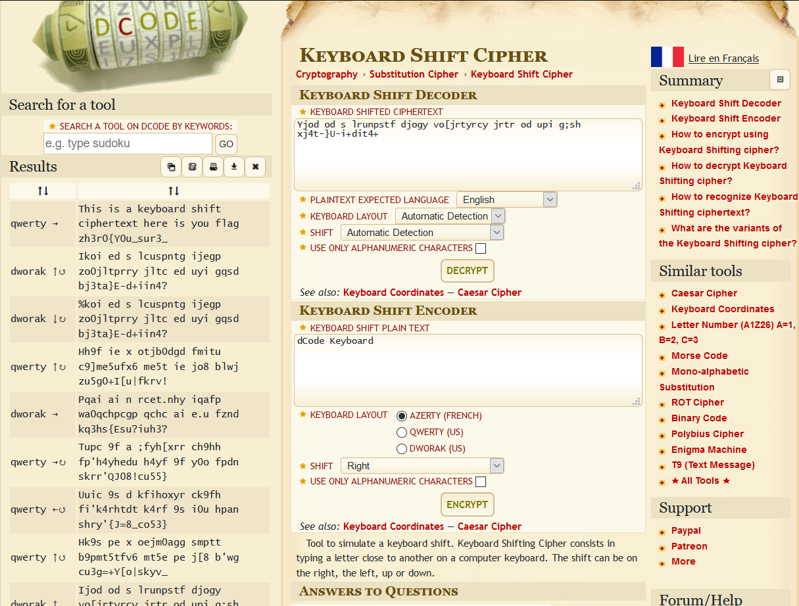
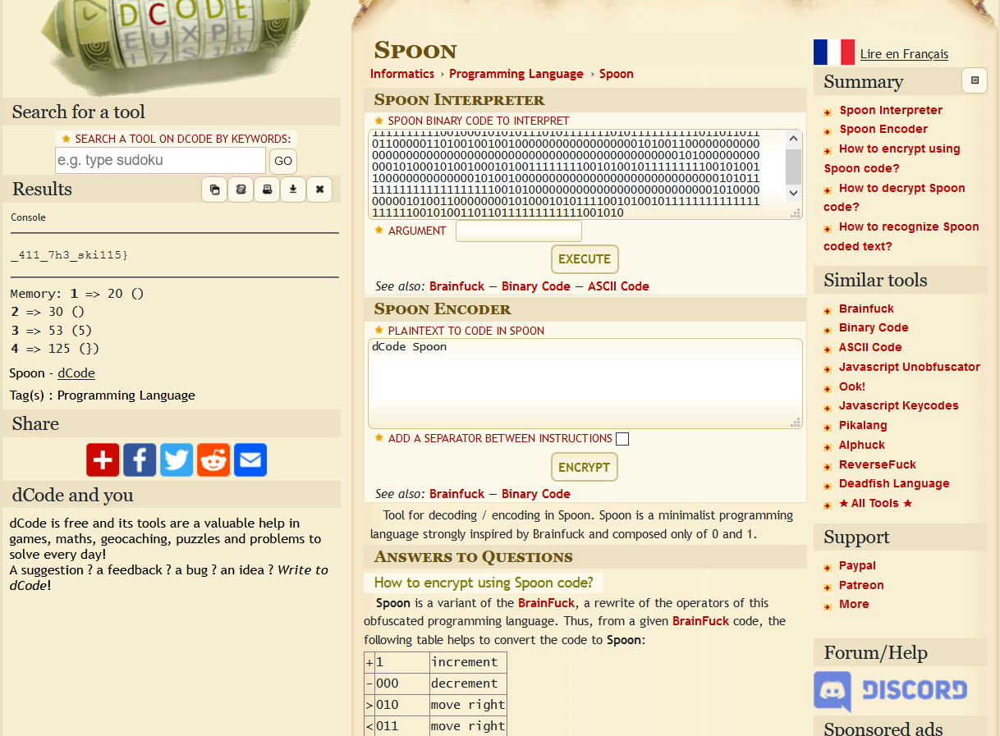

# Mix

## Description
```
At the BASEment no. 65536, A man is irritated with SHIFT key in his KEYBOARD as it's a sticky key, A kid is having chocolate icecream with a SPOON.

Author : Whit3_D3vi1
```

## Challenge Files
- [Mix.zip](Mix.zip)
  - [Mix/chall_encrypted.txt](Mix/chall_encrypted.txt)
  - [Mix/flag.txt](Mix/flag.txt)

[flag.txt](flag.txt) reads
```
If you opened this then you are a n00b
```
HAHA VERY FUNNY

[chall_encrypted.txt](chall_encrypted.txt) contains some seemingly chinese.  
since BASE65536 is a **BIG** hint to [base 65536](https://pypi.org/project/base65536/), We do stuff.  

```python
import base65536
with open('chall_encrypted.txt','r') as chall_enc:
    data = chall_enc.read()

data1 = "".join( chr(ord(i)%256)+chr(ord(i)//256) for i in data )

d = base65536.decode(data)
print(d.decode())
```

Which prints out some neat stuff  
```
flag 1:
Yjod od s lrunpstf djogy vo[jrtyrcy jrtr od upi g;sh xj4t-}U-i+dit4+

flag 2:
3030313130313030203031313130303130203030313130303131203031303131313131203030313130313030203031313130313131203030313130303131203031313130303131203030313130303030203031313031313031203030313130303131203031303131313131203031313130313131203031313031303031203030313130313131203031313031303030

flag 3:
MTExMTExMTExMTAwMTAwMDEwMTAxMDExMTAxMDExMTExMTEwMTAxMTExMTExMTExMDExMDExMDExMDExMDAwMDAxMTAxMDAxMDAxMDAxMDAwMDAwMDAwMDAwMDAwMDAwMTAxMDAxMTAwMDAwMDAwMDAwMDAwMDAwMDAwMDAwMDAwMDAwMDAwMDAwMDAwMDAwMDAwMDAwMDAwMDAwMDAwMTAxMDAwMDAwMDAwMDAwMTAxMDAwMTAxMDAxMDAwMTAxMDAxMTExMTExMTAwMTAxMDAxMDExMTExMTExMTAwMTAxMDAxMTAwMDAwMDAwMDAwMDAwMTAxMDAxMDAwMDAwMDAwMDAwMDAwMDAwMDAwMDAwMDAwMDAwMTAxMDExMTExMTExMTExMTExMTExMTExMDAxMDEwMDAwMDAwMDAwMDAwMDAwMDAwMDAwMDAwMDAxMDEwMDAwMDAwMDAxMDEwMDExMDAwMDAwMDAxMDEwMDAxMDEwMTExMTAwMTAxMDAxMDExMTExMTExMTExMTExMTExMTExMDAxMDEwMDExMDExMDExMTExMTExMTExMTAwMTAxMA==
```

Now we have 3 parts, lets work with hints as usual.
So the first part must be KEYBOARD SHIFT cipher  
At this point, I am wondering why is [dcode.fr](https://www.dcode.fr/keyboard-shift-cipher) ***S0 GOOD***.  


And we get the first part as `This is a keyboard shift ciphertext here is you flag zh3r0{Y0u_sur3_`

Now moving to second part, we dont even need a hint,  
```python
f2 = "3030313130313030203031313130303130203030313130303131203031303131313131203030313130313030203031313130313131203030313130303131203031313130303131203030313130303030203031313031313031203030313130303131203031303131313131203031313130313131203031313031303031203030313130313131203031313031303030"
print(bytes.fromhex(f2))

# b'00110100 01110010 00110011 01011111 00110100 01110111 00110011 01110011 00110000 01101101 00110011 01011111 01110111 01101001 00110111 01101000'

flag2 = "".join(chr(int(i,2)) for i in bytes.fromhex(f2).split())
print(flag2)
```

And just like that, we have `4r3_4w3s0m3_wi7h` as second part of flag

Coming to third part, it seemingly is base64 encoding,
```python
'MTExMTExMTExMTAwMTAwMDEwMTAxMDExMTAxMDExMTExMTEwMTAxMTExMTExMTExMDExMDExMDExMDExMDAwMDAxMTAxMDAxMDAxMDAxMDAwMDAwMDAwMDAwMDAwMDAwMTAxMDAxMTAwMDAwMDAwMDAwMDAwMDAwMDAwMDAwMDAwMDAwMDAwMDAwMDAwMDAwMDAwMDAwMDAwMDAwMDAwMTAxMDAwMDAwMDAwMDAwMTAxMDAwMTAxMDAxMDAwMTAxMDAxMTExMTExMTAwMTAxMDAxMDExMTExMTExMTAwMTAxMDAxMTAwMDAwMDAwMDAwMDAwMTAxMDAxMDAwMDAwMDAwMDAwMDAwMDAwMDAwMDAwMDAwMDAwMTAxMDExMTExMTExMTExMTExMTExMTExMDAxMDEwMDAwMDAwMDAwMDAwMDAwMDAwMDAwMDAwMDAxMDEwMDAwMDAwMDAxMDEwMDExMDAwMDAwMDAxMDEwMDAxMDEwMTExMTAwMTAxMDAxMDExMTExMTExMTExMTExMTExMTExMDAxMDEwMDExMDExMDExMTExMTExMTExMTAwMTAxMA=='
print(base64.b64decode(f3))

# b'1111111111001000101010111010111111101011111111110110110110110000011010010010010000000000000000001010011000000000000000000000000000000000000000000000000000000001010000000000001010001010010001010011111111001010010111111111001010011000000000000001010010000000000000000000000000000001010111111111111111111110010100000000000000000000000000010100000000010100110000000010100010101111001010010111111111111111111110010100110110111111111111001010'
```
Which turns out to be some sort of binary, lets take third hint SPOON to our help and hey, never to forget [dcode.fr](https://www.dcode.fr/spoon-language)



We get the third part of flag `_411_7h3_ski115}`

### zh3r0{Y0u_sur3_4r3_4w3s0m3_wi7h_411_7h3_ski115}
