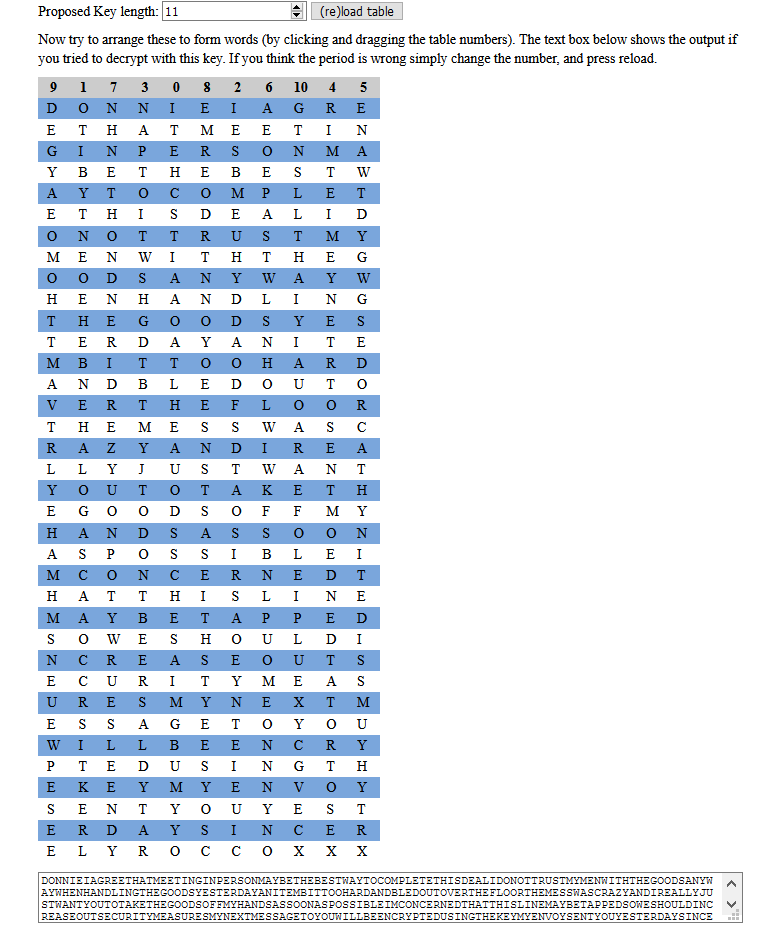

# 04

```
IOINR EANED GTTEA INEHM ETEIS
PMAON RGNHB BTTWE EEYSC YMOET
PTOAL STEII DAHDE LTNUT MYSOR
OTIEH WEGTN TMHAO YSYWW DNOAA
EDHNG LNNHI OHDGE SSEOT YAEAD
TENRY TITBO TRDHI OMALN DBTOO
DEAUH EFTOR LREVO EHSMS CWEST
AAADY EAIZN RRULT JNTWY SLAOO
ATTHK UTYED GOOMY FOSEF SASDO
NSNAH OSSIO EIBPS ALCCR NDTNO
EMEHA STNEL TIHIE AABED PYTMP
SOOED IUWHS LACEE TSORS NUICY
RASMU TEEMR NSTME EYUXG STAOU
OSEEY BIELR YNLEW CUTID THNES
PGMKE YOYNE YEVYE UTSTY NOSEY
RIAER NDSEC OLCRX XOYCE X

The flag is the 2nd and 3rd 9 letter words concatenated together
```

The first thing while dealing with simple ciphers is checking [letter frequency](https://en.wikipedia.org/wiki/Letter_frequency).
Heading to frequency analysis section of [dcode.fr](https://www.dcode.fr/frequency-analysis)
|Letter|Count|Percentage|
|:--:|:--:|:--:|
|E| 53×|13.38%|
|T| 38×|9.6% |
|O| 34×|8.59%|
|S| 31×|7.83%|
|A| 28×|7.07%|
|N| 27×|6.82%|
|Y| 23×|5.81%|
|I| 20×|5.05%|
|D| 18×|4.55%|
|H| 17×|4.29%|
|R| 17×|4.29%|
|M| 14×|3.54%|
|L| 13×|3.28%|
|U| 11×|2.78%|
|C| 10×|2.53%|
|G| 8× |2.02%|
|W| 8× |2.02%|
|B| 7× |1.77%|
|P| 6× |1.52%|
|X| 4× |1.01%|
|F| 3x |0.76%|
|V| 3× |0.51%|
|K| 2× |0.51%|
|Z| 1x |0.25%|
|J| 1x |0.25%|

This cipher turned out to be [Columnar Shift cipher](), A good visual solver for the same turns out to be [this site](http://tholman.com/other/transposition/)



```
DONNIEIAGREETHATMEETINGINPERSONMAYBETHEBESTWAYTOCOMPLETETHISDEALIDONOTTRUST
MYMENWITHTHEGOODSANYWAYWHENHANDLINGTHEGOODSYESTERDAYANITEMBITTOOHARDANDBLED
OUTOVERTHEFLOORTHEMESSWASCRAZYANDIREALLYJUSTWANTYOUTOTAKETHEGOODSOFFMYHANDS
ASSOONASPOSSIBLEIMCONCERNEDTHATTHISLINEMAYBETAPPEDSOWESHOULDINCREASEOUTSECU
RITYMEASURESMYNEXTMESSAGETOYOUWILLBEENCRYPTEDUSINGTHEKEYMYENVOYSENTYOUYESTE
RDAYSINCERELYROCCOXXX
```
Fixing spaces in the plaintext, we get,
```
DONNIE I AGREE THAT MEETING IN PERSON MAY BE THE BEST WAY TO COMPLETE 
THIS DEAL I DO NOT TRUST MY MEN WITH THE GOODS ANYWAY WHEN HANDLING THE
GOODS YESTERDAY AN ITEM BIT TOO HARD AND BLED OUT OVER THE FLOOR THE MESS
WAS CRAZY AND I REALLY JUST WANT YOU TO TAKE THE GOODS OFF MY HANDS AS 
SOON AS POSSIBLE I M CONCERNED THAT THIS LINE MAY BE TAPPED SO WE SHOULD 
INCREASE OUT SECURITY MEASURES MY NEXT MESSAGE TO YOU WILL BE ENCRYPTED 
USING THE KEY MY ENVOY SENT YOU YESTERDAY SINCERELY ROCCO XXX
```

This is the list of all 9 letter words, we have to take 2nd and 3rd to form the flag
```python
['YESTERDAY', 'CONCERNED', 'ENCRYPTED', 'YESTERDAY', 'SINCERELY']
```

#### CONCERNEDENCRYPTED

Here is a better analysis of ciphers `01`-`06` [Youtube Link](https://www.youtube.com/watch?v=9Q5Q1Nn5Vss)
