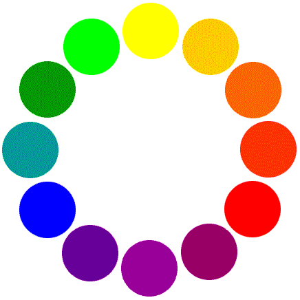
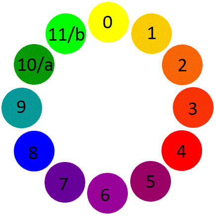

# 12-shades-of-redpwn

## Description
```
Everyone's favorite guess god Tux just sent me a flag that he somehow encrypted with a color wheel!

I don't even know where to start, the wheel looks more like a clock than a cipher... can you help me crack the code?
```

## Files

- [color-wheel.jpg](color-wheel.jpg)


- [ciphertext.jpg](ciphertext.jpg) "Text" XD


Lets think like a clock, and start numbering colors from `0-11` 


And if we map the corresponding numbers, we get  


```
86 90 81 87 a3 49 99 43 97 97 41 92 49 7b 41 97 7b 44 92 7b 44 96 98 a5
```

Now, we know that the flag begins with the prefix `flag{`, which helps us easily guess what it is, since `'f'` and `'l'` differ by `4`, here the ciphertext also differs by `4` i.e `90-86`. Also, `'l'` and `'a'` differ by 11, which confirms, that it is base 12 encoding.

Voila, here we go
```python
EXTRACTED = '86 90 81 87 a3 49 99 43 97 97 41 92 49 7b 41 97 7b 44 92 7b 44 96 98 a5'

flag = ''.join([chr(int(i,12)) for i in EXTRACTED.split()])
print(flag)
```


### flag = flag{9u3ss1n9_1s_4n_4rt}


