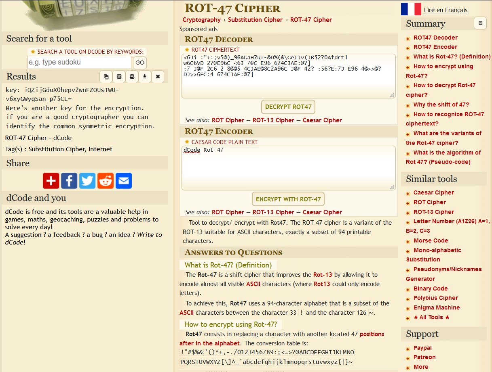
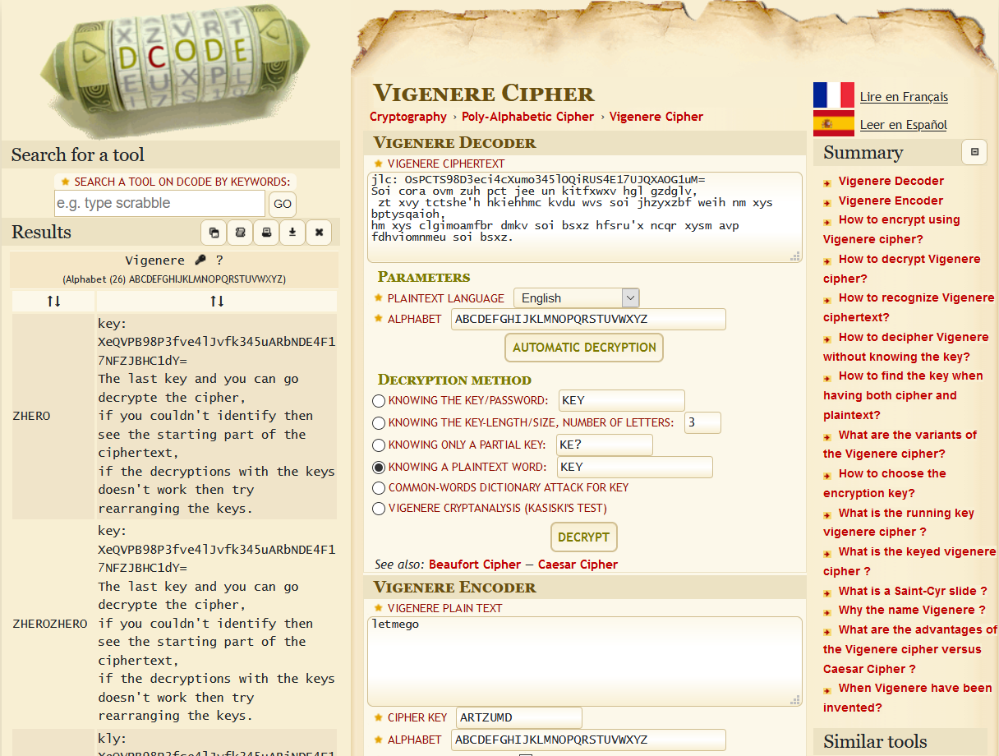

# Uncipher Me

## Description


## Challenge Files
- [ct.txt](ct.txt)
- [key.txt](key.txt)
- [key_2.txt](key_2.txt)
- [key_3.txt](key_3.txt)

Lets begin with the keys.
```bash
cat key.txt
TjogR0kzRE9OWldHUVpER01SVkdFWURLT0JWSEUyRE1NSllHNFpEQU5CVEdBNFRJTUJSR0VZVEdNQlpHTTRUU01CWUdJMlRNTUJRR1U0RElOSlhHUTJUS05CUUdBM1RLTlpTRzQzRE1PQlRIRTJESU9KWUc0M0RRTVpXSEU0VE1NWlpHUVlUU01CVEhFWkRBTkpYSEU0RE1NSldHTVlURU5KU0c0NFRDTVpVSEU0RElOSlFHUVlUTU5SV0dNNFRBTVJYR000VFFOUlVHSVlUQ01SWkdJMkRJTkJYR0EzVFNNUlZHSTREQ05aWUc0NERBTlpVR1lZRE1NQlRHUTNEQU9CWEc0WkRHTkpWSEVZRFNOQlJIQTJUS01KV0dZNFRPT0pVR1EzVEtPQlRHNDRUT09CVkdJNERPTUpRR1VaVE1OQlVHRTRET05SWkdBWVRTT0JURzQ0REFNWlRHRVpUQ09KVUdRM0RJTlpTR1FaRE9OUlRHWTNES09KVEdFWkRHT0JWR0UzVEVPSlNIQTRUTU5SVkdNWURTTVJXR0EyRE9OSlVHNDRUT01CWEdFWURHTVJYR1VaVE1PSlZHNFlEUU5KVkhBNERNTlJSR01aVFFOUldHSTNET05aU0dBM0RDT0pSR00zREFOUlRHWTJUU01KVUhBNERPTlpSR0kzREtOWlJHWTJEQ09KWUdFM0RTTlpRR0lZRFFOWlJHUVpETU1CVEhBWkRBTkJYSEU0VENNSlpHQTNUQU1SVEhFWlRBTUJWR0FaRENOWlVHWTJUSU1aU0c0WVRRTVpXR0U0RFFPSlhHQVpUU09CU0dZNFRBT0JUR00yVEdOQlpHSTJERU1CUkc0NFRHTVpSSEUzREtOWlZHUTRETU5KWkdJMkRRTkJYSEEzRENOQlpHQTRERU1aVEdZWVRFTkJZR0U0VEVNUlFHTTRET01CVkdZWVRLTUpSR01aVEVPQlJHSTJUUU9CWEdVMlRLTkJZR0lZRE1OQlNHQVlER01KWEhBWlRFTVJTR0UzVFFPQlNHRTRETU5KWUdBMlRPTUpUR0VaVEVOUllHTTRETU1KUUdJNERJTUpZRzRZVE9PSlVIRTRET09CUUdJWlRNTUpXR00yVEVPQlhHSTJUT09KU0dNM1RRT0pSRzRaVElNUlNHSVlUT09KUkdRWVRJTkpZRzQzVEdPQlJHWVpUR09CU0hBM0RRTlpZR1FaVFNOQlpHWTNEQU1aU0dVM1RHTkJSR1FaVENPQlRHUTNUTU1aVUdRMkRHTVpTR0FZREFPSlJHSTJEU01KU0dVM0RJTlpUSEVaUT09PT0KIGU6IEdZMlRLTVpYCiBjdDogIEdCN2tUSGFSZGtII0lSZkhaP1JqSDgoYWZHYy0wZUcmZUxiSTVJUmlIYUlwbEcmVk9tR2N6K2VGZj0oWkYpPWhZSDhEOWRIODM/WkgjOWduSTU5TGFJV3tzZUdjLTlpR0JQKFlHQjdZV0lXYWFmSVdzcGdIYTBqbkclel9nSVhFfm1IOTBnaklXI3lvSVhFO2lHZERSa0k1anNwSCNqdmpJV2FSY0djXzxaR2RWYWhIOD9qbUdCITBiSCE/RmZHJmVVbUYqIUNkSCM5VWpIWj9GZUZmbGhhRmZjZVdHY3o8Ykk1UmdnSCE/T2ZIWndJZ0k1YVhhSDgzX2VHJjRDbEgjUlhmSCNJZGlGZ1A/WUgjYXNrR0JHemFGZ1EzZkk1e35vRipQPGJGKlB0VEhaZTlnSTVhcGtJVyNwbkhaVXxaSVhPNW1IYUltaEhaZF9YR0JQdFVGZmxZVklXI3lxRippOWVIODMrWEgjYXBmR2NgNmdGZzdxYkhhOXBpSFo/TGdHZFZkakdCaCtkSFplM2dIOTBka0YqcjZpSVdhTGdJV3smbUlXYVJiSTVzJnJJNVJka0lXYUxnSGFJZGNHQlAoWUcmblJqSCNJZ2lHQlAkZEdjYEZqRyZuUmZHQmAzWUk1OztsSFpuRmZHJSsrVkYpfWJTSCM5VWpGZ1o5ZkdCK3xYRyZESWhHY3ErZkhhOVJoRmdQJFhJWE47Z0dCUChiRiklVlZGZn13ZEZmJWJWSCM5UmdIIzlhaUhhSWplSTVqeWtHYy0zakclKz9YSCE/SWhHJV8/WUYqITZjRil9ZVdJNTlYaElYRSNpSTVqZ2ZGKiEzaEghdl9XR0I3elpJNTAzV0YpPW5ZSFooRmJIWmR8VklXO2dmRmZ9dGNGZ0d3VkYqUChiSGE5cG1HZE02Y0k1SWdmR0JoPFpHZFZJZkYqUChjSCNzJm1HQit8YUYqaHxiSFpVK1pGKiE2ZUdkVkxrSVg1e3RHZE1YbkhaKExoSCNJT2RJNTAzWEZmPWhVRzU=
```
Seems like base64
```python
import base64
key1 = base64.b64decode(key1)
    print(key1.decode())

# N: GI3DONZWGQZDGMRVGEYDKOBVHE2DMMJYG4ZDANBTGA4TIMBRGEYTGMBZGM4TSMBYGI2TMMBQGU4DINJXGQ2TKNBQGA3TKNZSG43DMOBTHE2DIOJYG43DQMZWHE4TMMZZGQYTSMBTHEZDANJXHE4DMMJWGMYTENJSG44TCMZUHE4DINJQGQYTMNRWGM4TAMRXGM4TQNRUGIYTCMRZGI2DINBXGA3TSMRVGI4DCNZYG44DANZUGYYDMMBTGQ3DAOBXG4ZDGNJVHEYDSNBRHA2TKMJWGY4TOOJUGQ3TKOBTG44TOOBVGI4DOMJQGUZTMNBUGE4DONRZGAYTSOBTG44DAMZTGEZTCOJUGQ3DINZSGQZDONRTGY3DKOJTGEZDGOBVGE3TEOJSHA4TMNRVGMYDSMRWGA2DONJUG44TOMBXGEYDGMRXGUZTMOJVG4YDQNJVHA4DMNRRGMZTQNRWGI3DONZSGA3DCOJRGM3DANRTGY2TSMJUHA4DONZRGI3DKNZRGY2DCOJYGE3DSNZQGIYDQNZRGQZDMMBTHAZDANBXHE4TCMJZGA3TAMRTHEZTAMBVGAZDCNZUGY2TIMZSG4YTQMZWGE4DQOJXGAZTSOBSGY4TAOBTGM2TGNBZGI2DEMBRG44TGMZRHE3DKNZVGQ4DMNJZGI2DQNBXHA3DCNBZGA4DEMZTGYYTENBYGE4TEMRQGM4DOMBVGYYTKMJRGMZTEOBRGI2TQOBXGU2TKNBYGIYDMNBSGAYDGMJXHAZTEMRSGE3TQOBSGE4DMNJYGA2TOMJTGEZTENRYGM4DMMJQGI4DIMJYG4YTOOJUHE4DOOBQGIZTMMJWGM2TEOBXGI2TOOJSGM3TQOJRG4ZTIMRSGIYTOOJRGQYTINJYG43TGOBRGYZTGOBSHA3DQNZYGQZTSNBZGY3DAMZSGU3TGNBRGQZTCOBTGQ3TMMZUGQ2DGMZSGAYDAOJRGI2DSMJSGU3DINZTHEZQ====
# e: GY2TKMZX
# ct:  GB7kTHaRdkH#IRfHZ?RjH8(afGc-0eG&eLbI5IRiHaIplG&VOmGcz+eFf=(ZF)=hYH8D9dH83?ZH#9gnI59LaIW{seGc-9iGBP(YGB7YWIWaafIWspgHa0jnG%z_gIXE~mH90gjIW#yoIXE;iGdDRkI5jspH#jvjIWaRcGc_<ZGdVahH8?jmGB!0bH!?FfG&eUmF*!CdH#9UjHZ?FeFflhaFfceWGcz<bI5RggH!?OfHZwIgI5aXaH83_eG&4ClH#RXfH#IdiFgP?YH#askGBGzaFgQ3fI5{~oF*P<bF*PtTHZe9gI5apkIW#pnHZU|ZIXO5mHaImhHZd_XGBPtUFflYVIW#yqF*i9eH83+XH#apfGc`6gFg7qbHa9piHZ?LgGdVdjGBh+dHZe3gH90dkF*r6iIWaLgIW{&mIWaRbI5s&rI5RdkIWaLgHaIdcGBP(YG&nRjH#IgiGBP$dGc`FjG&nRfGB`3YI5;;lHZnFfG%++VF)}bSH#9UjFgZ9fGB+|XG&DIhGcq+fHa9RhFgP$XIXN;gGBP(bF)%VVFf}wdFf%bVH#9RgH#9aiHaIjeI5jykGc-3jG%+?XH!?IhG%_?YF*!6cF)}eWI59XhIXE#iI5jgfF*!3hH!v_WGB7zZI503WF)=nYHZ(FbHZd|VIW;gfFf}tcFgGwVF*P(bHa9pmGdM6cI5IgfGBh<ZGdVIfF*P(cH#s&mGB+|aF*h|bHZU+ZF*!6eGdVLkIX5{tGdMXnHZ(LhH#IOdI503XFf=hUG5
```
Alright!, Seems like RSA inside the key huh  
`N` and `e` seem to be base32, since they are all CAPS
`ct` appears to be base85, since all these weird characters

```python
N = key1[1]
e = key1[3]
c = key1[5]

N = int(base64.b32decode(N))
e = int(base64.b32decode(e))
c = int(base64.b85decode(c))
p,q = sympy.ntheory.primefactors(N)
d = pow(e, -1, (p-1)*(q-1))
m = pow(c,d,N)

m = bytes.fromhex(hex(m)[2:])
print(m.decode())
```

This brings us
```
key: kD87Ef4y043nhee-W_Hytc0d3Bkiw4Gw21m-7AHpZkc=
This is one of the keys for the encryption.Totally 3 keys to decrypt the encrypted text
```

Okay, time for round 2

```bash
cat key_2.txt
Are your rots strong.

<6Ji :"+:;v5@)_96AGaH?u+~&D%(&\GeIJv(JB$2?0Afdrtl
w6C6VD 2?@E96C <6J 7@C E96 6?4CJAE:@?]
:7 J@F 2C6 2 8@@5 4CJAE@8C2A96C J@F 42? :56?E:7J E96 4@>>@? DJ>>6EC:4 6?4CJAE:@?]
```
Seems like a much anticipated rot47, [dcode.fr](https://www.dcode.fr/rot-47-cipher) to our rescue



```
key: iQZijGdoX0hepv2wnFZOUsTWU-v6xyGWyqSan_p75CE=
Here's another key for the encryption.
if you are a good cryptographer you can identify the common symmetric encryption.
```
ROUND 3, FIGHT  

```bash
cat key_3.txt

jlc: OsPCTS98D3eci4cXumo345lOQiRUS4E17UJQXAOG1uM=
Soi cora ovm zuh pct jee un kitfxwxv hgl gzdglv,
zt xvy tctshe'h hkiehhmc kvdu wvs soi jhzyxzbf weih nm xys bptysqaioh,
hm xys clgimoamfbr dmkv soi bsxz hfsru'x ncqr xysm avp fdhviomnmeu soi bsxz
```
First guess, Vignere cipher, lets head to [dcode.fr](https://www.dcode.fr/vigenere-cipher) again,



```
key: XeQVPB98P3fve4lJvfk345uARbNDE4F17NFZJBHC1dY=
The last key and you can go decrypte the cipher,
if you couldn't identify then see the starting part of the ciphertext,
if the decryptions with the keys doesn't work then try rearranging the keys.
```
Now this is the part, where things got ugly, apparently the `common symmetric encryption` used is not AES. Its rather `fernet` cipher, which could be identified from the head of ciphertext `gAAAAA`. Moreover, Only the `KEY2` was required, rest is just to make you do work :sad:

Anyways, we got our flag after so much churning

```python
from cryptography.fernet import Fernet
KEY2 = "iQZijGdoX0hepv2wnFZOUsTWU-v6xyGWyqSan_p75CE="
f = Fernet(KEY2)
print(f.decrypt(ct))
```

### zh3r0{Symm3tric_3ncrypti0n_i5_5tr0ng}
